# ISLR_club_6_Dec


#3.6.1 Libraries

```r
library (MASS)
library (ISLR)
```

```
## Warning: package 'ISLR' was built under R version 3.4.2
```
#3.6.2 Simple Linear Regression

```r
fix(Boston)
names(Boston)
```

```
##  [1] "crim"    "zn"      "indus"   "chas"    "nox"     "rm"      "age"    
##  [8] "dis"     "rad"     "tax"     "ptratio" "black"   "lstat"   "medv"
```

```r
#lm.fit =lm(medv∼lstat)
lm.fit <- lm(medv~lstat, data = Boston)
attach (Boston )
lm.fit <- lm(medv~lstat)
lm.fit
```

```
## 
## Call:
## lm(formula = medv ~ lstat)
## 
## Coefficients:
## (Intercept)        lstat  
##       34.55        -0.95
```

```r
summary(lm.fit)
```

```
## 
## Call:
## lm(formula = medv ~ lstat)
## 
## Residuals:
##     Min      1Q  Median      3Q     Max 
## -15.168  -3.990  -1.318   2.034  24.500 
## 
## Coefficients:
##             Estimate Std. Error t value Pr(>|t|)    
## (Intercept) 34.55384    0.56263   61.41   <2e-16 ***
## lstat       -0.95005    0.03873  -24.53   <2e-16 ***
## ---
## Signif. codes:  0 '***' 0.001 '**' 0.01 '*' 0.05 '.' 0.1 ' ' 1
## 
## Residual standard error: 6.216 on 504 degrees of freedom
## Multiple R-squared:  0.5441,	Adjusted R-squared:  0.5432 
## F-statistic: 601.6 on 1 and 504 DF,  p-value: < 2.2e-16
```

```r
names(lm.fit)
```

```
##  [1] "coefficients"  "residuals"     "effects"       "rank"         
##  [5] "fitted.values" "assign"        "qr"            "df.residual"  
##  [9] "xlevels"       "call"          "terms"         "model"
```

```r
coef(lm.fit)
```

```
## (Intercept)       lstat 
##  34.5538409  -0.9500494
```

```r
confint (lm.fit)
```

```
##                 2.5 %     97.5 %
## (Intercept) 33.448457 35.6592247
## lstat       -1.026148 -0.8739505
```

```r
predict (lm.fit ,data.frame(lstat=c(5 ,10 ,15)),interval ="confidence")
```

```
##        fit      lwr      upr
## 1 29.80359 29.00741 30.59978
## 2 25.05335 24.47413 25.63256
## 3 20.30310 19.73159 20.87461
```

```r
predict (lm.fit ,data.frame(lstat=c(5 ,10 ,15)),interval ="prediction")
```

```
##        fit       lwr      upr
## 1 29.80359 17.565675 42.04151
## 2 25.05335 12.827626 37.27907
## 3 20.30310  8.077742 32.52846
```

```r
plot(lstat,medv)
x <- plot(lstat,medv)
abline(lm.fit)
abline (lm.fit ,lwd =3)
abline (lm.fit ,lwd =3, col ="red")
```

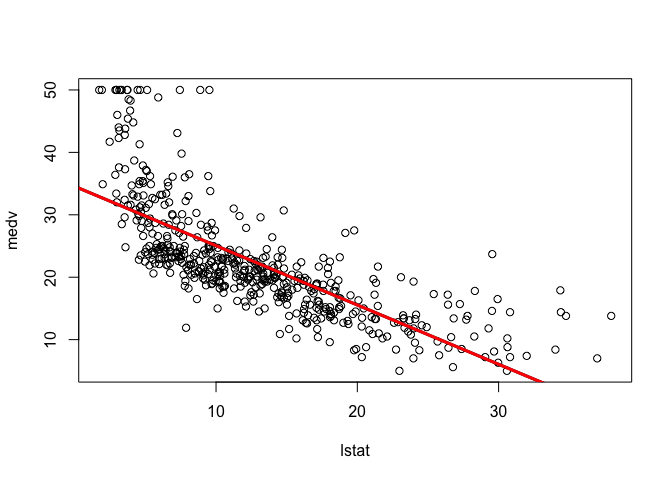<!-- -->

```r
plot(lstat ,medv ,col ="red ")
```

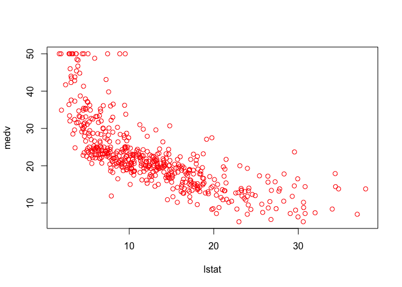<!-- -->

```r
plot(lstat ,medv ,pch =20)
```

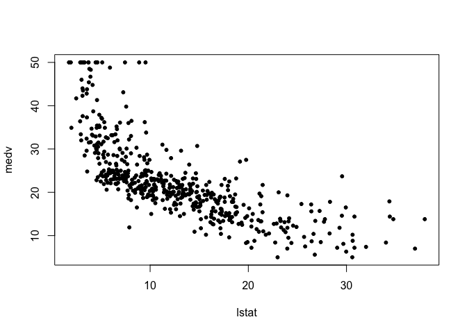<!-- -->

```r
plot(lstat ,medv ,pch ="+")
```

<!-- -->

```r
plot (1:20 ,1:20, pch =1:20)
```

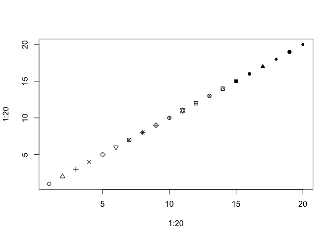<!-- -->

```r
par(mfrow =c(2,2))
plot(lm.fit)
```

<!-- -->

```r
plot(predict (lm.fit), residuals (lm.fit))
plot(predict (lm.fit), rstudent (lm.fit))
plot(hatvalues (lm.fit ))
which.max (hatvalues (lm.fit))
```

```
## 375 
## 375
```

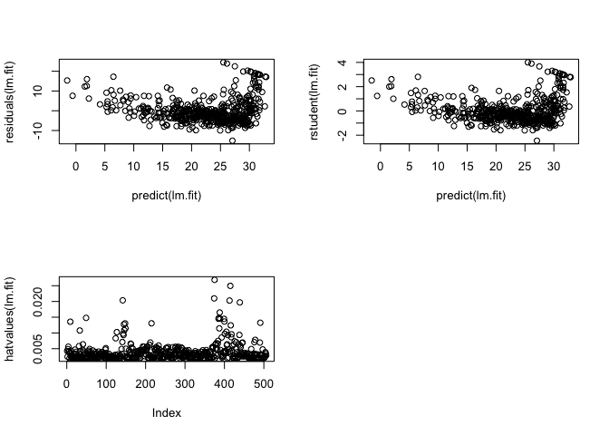<!-- -->
#3.7 Exercises

3.Suppose we have a data set with five predictors, X1 =GPA, X2 = IQ,
X3 = Gender (1 for Female and 0 for Male), X4 = Interaction between
GPA and IQ, and X5 = Interaction between GPA and Gender. The
response is starting salary after graduation (in thousands of dollars).
Suppose we use least squares to fit the model, and get ˆβ0 = 50, ˆβ1 =
20, ˆβ2 = 0.07, ˆβ3 = 35, ˆβ4 = 0.01, ˆβ5 = −10.
(a) Which answer is correct, and why?
i. For a fixed value of IQ and GPA, males earn more on average
than females.
 


ii. For a fixed value of IQ and GPA, females earn more on
average than males.
iii. For a fixed value of IQ and GPA, males earn more on average
than females provided that the GPA is high enough.
iv. For a fixed value of IQ and GPA, females earn more on
average than males provided that the GPA is high enough.

answer:
Y = 50 + 20(gpa) + 0.07(iq) + 35(gender) + 0.01(gpa * iq) - 10 (gpa * gender)
suppose : gpa l1 iq l2
(a) Y = 50 + 20 l1 + 0.07 l2 + 35 gender + 0.01(l1 * l2) - 10 (l1 * gender)
male: (gender = 0)   50 + 20 l1 + 0.07 l2 + 0.01(l1 * l2)
female: (gender = 1) 50 + 20 l1 + 0.07 l2 + 35 + 0.01(l1 * l2) - 10 (l1)
iii. Once the GPA is high enough, males earn more on average.

(b) Predict the salary of a female with IQ of 110 and a GPA of 4.0.

answer:
(b) Y(Gender = 1, IQ = 110, GPA = 4.0)
= 50 + 20 * 4 + 0.07 * 110 + 35 + 0.01 (4 * 110) - 10 * 4
= 137.1

(c) True or false: Since the coefficient for the GPA/IQ interaction
term is very small, there is very little evidence of an interaction
effect. Justify your answer.

answer:
(c) False. We must examine the p-value of the regression coefficient to
understand whether the interaction term is statistically significant or not.

8. This question involves the use of simple linear regression on the Auto
data set.
(a) Use the lm() function to perform a simple linear regression with
mpg as the response and horsepower as the predictor. Use the
summary() function to print the results. Comment on the output.
For example:
i. Is there a relationship between the predictor and the response?
ii. How strong is the relationship between the predictor and
the response?
iii. Is the relationship between the predictor and the response
positive or negative?
iv. What is the predicted mpg associated with a horsepower of
98? What are the associated 95% confidence and prediction
intervals?


```r
data(Auto)
summary(Auto)
```

```
##       mpg          cylinders      displacement     horsepower   
##  Min.   : 9.00   Min.   :3.000   Min.   : 68.0   Min.   : 46.0  
##  1st Qu.:17.00   1st Qu.:4.000   1st Qu.:105.0   1st Qu.: 75.0  
##  Median :22.75   Median :4.000   Median :151.0   Median : 93.5  
##  Mean   :23.45   Mean   :5.472   Mean   :194.4   Mean   :104.5  
##  3rd Qu.:29.00   3rd Qu.:8.000   3rd Qu.:275.8   3rd Qu.:126.0  
##  Max.   :46.60   Max.   :8.000   Max.   :455.0   Max.   :230.0  
##                                                                 
##      weight      acceleration        year           origin     
##  Min.   :1613   Min.   : 8.00   Min.   :70.00   Min.   :1.000  
##  1st Qu.:2225   1st Qu.:13.78   1st Qu.:73.00   1st Qu.:1.000  
##  Median :2804   Median :15.50   Median :76.00   Median :1.000  
##  Mean   :2978   Mean   :15.54   Mean   :75.98   Mean   :1.577  
##  3rd Qu.:3615   3rd Qu.:17.02   3rd Qu.:79.00   3rd Qu.:2.000  
##  Max.   :5140   Max.   :24.80   Max.   :82.00   Max.   :3.000  
##                                                                
##                  name    
##  amc matador       :  5  
##  ford pinto        :  5  
##  toyota corolla    :  5  
##  amc gremlin       :  4  
##  amc hornet        :  4  
##  chevrolet chevette:  4  
##  (Other)           :365
```

```r
attach(Auto)
lm.fit = lm(mpg ~ horsepower)
summary(lm.fit)
```

```
## 
## Call:
## lm(formula = mpg ~ horsepower)
## 
## Residuals:
##      Min       1Q   Median       3Q      Max 
## -13.5710  -3.2592  -0.3435   2.7630  16.9240 
## 
## Coefficients:
##              Estimate Std. Error t value Pr(>|t|)    
## (Intercept) 39.935861   0.717499   55.66   <2e-16 ***
## horsepower  -0.157845   0.006446  -24.49   <2e-16 ***
## ---
## Signif. codes:  0 '***' 0.001 '**' 0.01 '*' 0.05 '.' 0.1 ' ' 1
## 
## Residual standard error: 4.906 on 390 degrees of freedom
## Multiple R-squared:  0.6059,	Adjusted R-squared:  0.6049 
## F-statistic: 599.7 on 1 and 390 DF,  p-value: < 2.2e-16
```

```r
#i.Yes, there is a relationship between horsepower and mpg as deterined by testing the null hypothesis of coefficients equal to zero. we can see the F is latder than 1 and p-value of the F-statistic is close to zero we can reject the null hypothesis.

#ii.To calculate the residual error relative to the response we use the mean of the response and the RSE.The RSE of the lm.fit was  4.906 which indicates a percentage error of  4.906/mean(mpg, na.rm=T) * 100.0%. The R^2 of the lm.fit was about 0.60 60% of the variance in mpg is explained by horsepower.

#iii.The relationship between mpg and horsepower is negative. The more horsepower the less mpg fuel efficiency 

#iv.
predict(lm.fit, data.frame(horsepower=c(98)), interval="confidence")
```

```
##        fit      lwr      upr
## 1 24.46708 23.97308 24.96108
```

```r
#       fit      lwr      upr
#1 24.46708 23.97308 24.96108
predict(lm.fit, data.frame(horsepower=c(98)), interval="prediction")
```

```
##        fit     lwr      upr
## 1 24.46708 14.8094 34.12476
```

```r
#       fit     lwr      upr
#1 24.46708 14.8094 34.12476
```

(b) Plot the response and the predictor. Use the abline() function
to display the least squares regression line.


```r
plot(horsepower, mpg)
abline(lm.fit)
```

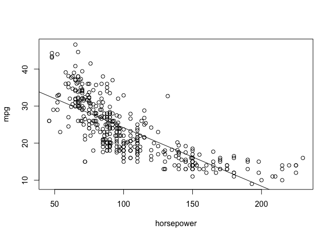<!-- -->

(c) Use the plot() function to produce diagnostic plots of the least
squares regression fit. Comment on any problems you see with
the fit.


```r
par(mfrow=c(2,2))
plot(lm.fit)
```

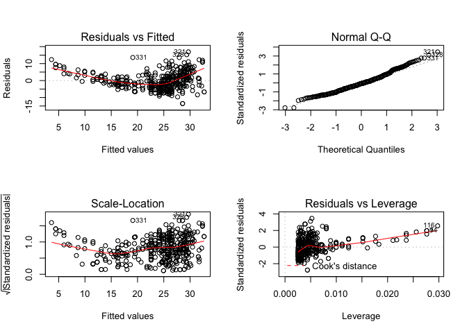<!-- -->

```r
#Based on the residuals plots, there is some evidence of non-linearity.
```

13. In this exercise you will create some simulated data and will fit simple
linear regression models to it. Make sure to use set.seed(1) prior to
starting part (a) to ensure consistent results.
(a) Using the rnorm() function, create a vector, x, containing 100
observations drawn from a N(0, 1) distribution. This represents
a feature, X.


```r
set.seed(1)
x = rnorm(100)
```

(b) Using the rnorm() function, create a vector, eps, containing 100
observations drawn from a N(0, 0.25) distribution i.e. a normal
distribution with mean zero and variance 0.25.


```r
eps = rnorm(100, 0, sqrt(0.25))
```

(c) Using x and eps, generate a vector y according to the model
Y = −1 + 0.5X + e (3.39)
What is the length of the vector y? What are the values of β0
and β1 in this linear model?


```r
y = -1 + 0.5*x + eps
#y is of length 100. β0 is -1, β1 is 0.5.
```

(d) Create a scatterplot displaying the relationship between x and
y. Comment on what you observe.


```r
plot(x,y)
```

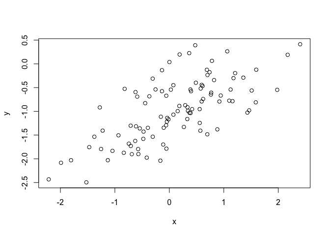<!-- -->

```r
#I observe a linear relationship between x and y with a positive slope.
```

(e) Fit a least squares linear model to predict y using x. Comment
on the model obtained. How do ˆ β0 and ˆ β1 compare to β0 and
β1?


```r
lm.fit = lm(y~x)
summary(lm.fit)
```

```
## 
## Call:
## lm(formula = y ~ x)
## 
## Residuals:
##      Min       1Q   Median       3Q      Max 
## -0.93842 -0.30688 -0.06975  0.26970  1.17309 
## 
## Coefficients:
##             Estimate Std. Error t value Pr(>|t|)    
## (Intercept) -1.01885    0.04849 -21.010  < 2e-16 ***
## x            0.49947    0.05386   9.273 4.58e-15 ***
## ---
## Signif. codes:  0 '***' 0.001 '**' 0.01 '*' 0.05 '.' 0.1 ' ' 1
## 
## Residual standard error: 0.4814 on 98 degrees of freedom
## Multiple R-squared:  0.4674,	Adjusted R-squared:  0.4619 
## F-statistic: 85.99 on 1 and 98 DF,  p-value: 4.583e-15
```

```r
#The linear regression fits a model close to the true value of the coefficients as was constructed. The model has a large F-statistic with a near-zero p-value so the null hypothesis can be rejected.
```

(f) Display the least squares line on the scatterplot obtained in (d).
Draw the population regression line on the plot, in a different
color.


```r
plot(x, y)
x<- plot(x,y)
abline(lm.fit, lwd=3, col=2)
abline(-1, 0.5, lwd=3, col=3)
legend(-1, legend = c("model fit", "pop. regression"), col=2:3, lwd=3)
```

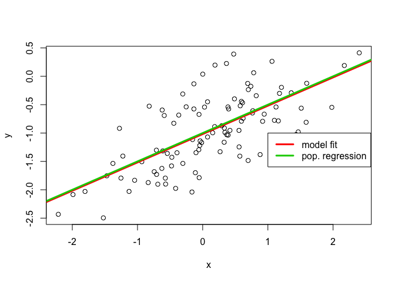<!-- -->

(h) Repeat (a)–(f) after modifying the data generation process in
such a way that there is less noise in the data. The model (3.39)
should remain the same. You can do this by decreasing the variance
of the normal distribution used to generate the error term
e in (b). Describe your results.


```r
set.seed(1)
eps1 = rnorm(100, 0, 0.125)
x1 = rnorm(100)
y1 = -1 + 0.5*x1 + eps1
plot(x1, y1)
x <- plot(x1, y1)
x
```

```
## NULL
```

```r
lm.fit1 = lm(y1~x1)
summary(lm.fit1)
```

```
## 
## Call:
## lm(formula = y1 ~ x1)
## 
## Residuals:
##      Min       1Q   Median       3Q      Max 
## -0.29052 -0.07545  0.00067  0.07288  0.28664 
## 
## Coefficients:
##             Estimate Std. Error t value Pr(>|t|)    
## (Intercept) -0.98639    0.01129  -87.34   <2e-16 ***
## x1           0.49988    0.01184   42.22   <2e-16 ***
## ---
## Signif. codes:  0 '***' 0.001 '**' 0.01 '*' 0.05 '.' 0.1 ' ' 1
## 
## Residual standard error: 0.1128 on 98 degrees of freedom
## Multiple R-squared:  0.9479,	Adjusted R-squared:  0.9474 
## F-statistic:  1782 on 1 and 98 DF,  p-value: < 2.2e-16
```

```r
abline(lm.fit1, lwd=3, col=2)
abline(-1, 0.5, lwd=3, col=3)
legend(-1, legend = c("model fit", "pop. regression"), col=2:3, lwd=3)
```

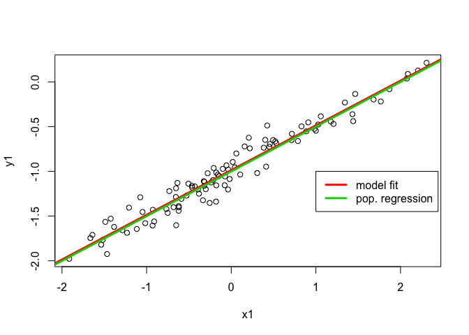<!-- -->

```r
#the error observed in R^2 and RSE decreases considerably.
```

(i) Repeat (a)–(f) after modifying the data generation process in
such a way that there is more noise in the data. The model
(3.39) should remain the same. You can do this by increasing
the variance of the normal distribution used to generate the
error term e in (b). Describe your results.


```r
set.seed(1)
eps2 = rnorm(100, 0, 0.5)
x2 = rnorm(100)
y2 = -1 + 0.5*x2 + eps2
plot(x2, y2)
lm.fit2 = lm(y2~x2)
summary(lm.fit2)
```

```
## 
## Call:
## lm(formula = y2 ~ x2)
## 
## Residuals:
##      Min       1Q   Median       3Q      Max 
## -1.16208 -0.30181  0.00268  0.29152  1.14658 
## 
## Coefficients:
##             Estimate Std. Error t value Pr(>|t|)    
## (Intercept) -0.94557    0.04517  -20.93   <2e-16 ***
## x2           0.49953    0.04736   10.55   <2e-16 ***
## ---
## Signif. codes:  0 '***' 0.001 '**' 0.01 '*' 0.05 '.' 0.1 ' ' 1
## 
## Residual standard error: 0.4514 on 98 degrees of freedom
## Multiple R-squared:  0.5317,	Adjusted R-squared:  0.5269 
## F-statistic: 111.2 on 1 and 98 DF,  p-value: < 2.2e-16
```

```r
abline(lm.fit2, lwd=3, col=2)
abline(-1, 0.5, lwd=3, col=3)
legend(-1, legend = c("model fit", "pop. regression"), col=2:3, lwd=3)
```

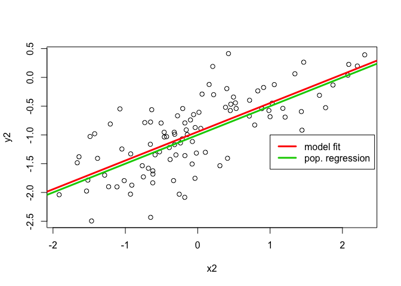<!-- -->

```r
#the error observed in R^2 and RSE increases considerably.
```

(j) What are the confidence intervals for β0 and β1 based on the
original data set, the noisier data set, and the less noisy data
set? Comment on your results.


```r
confint(lm.fit)
```

```
##                  2.5 %     97.5 %
## (Intercept) -1.1150804 -0.9226122
## x            0.3925794  0.6063602
```

```r
confint(lm.fit1)
```

```
##                 2.5 %     97.5 %
## (Intercept) -1.008805 -0.9639819
## x1           0.476387  0.5233799
```

```r
confint(lm.fit2)
```

```
##                  2.5 %     97.5 %
## (Intercept) -1.0352203 -0.8559276
## x2           0.4055479  0.5935197
```

```r
#All intervals seem to be centered on approximately 0.5.
```

15. This problem involves the Boston data set, which we saw in the lab
for this chapter. We will now try to predict per capita crime rate
using the other variables in this data set. In other words, per capita
crime rate is the response, and the other variables are the predictors.
(a) For each predictor, fit a simple linear regression model to predict
the response. Describe your results. In which of the models is
there a statistically significant association between the predictor
and the response? Create some plots to back up your assertions.


```r
library(MASS)
summary(Boston)
```

```
##       crim                zn             indus            chas        
##  Min.   : 0.00632   Min.   :  0.00   Min.   : 0.46   Min.   :0.00000  
##  1st Qu.: 0.08204   1st Qu.:  0.00   1st Qu.: 5.19   1st Qu.:0.00000  
##  Median : 0.25651   Median :  0.00   Median : 9.69   Median :0.00000  
##  Mean   : 3.61352   Mean   : 11.36   Mean   :11.14   Mean   :0.06917  
##  3rd Qu.: 3.67708   3rd Qu.: 12.50   3rd Qu.:18.10   3rd Qu.:0.00000  
##  Max.   :88.97620   Max.   :100.00   Max.   :27.74   Max.   :1.00000  
##       nox               rm             age              dis        
##  Min.   :0.3850   Min.   :3.561   Min.   :  2.90   Min.   : 1.130  
##  1st Qu.:0.4490   1st Qu.:5.886   1st Qu.: 45.02   1st Qu.: 2.100  
##  Median :0.5380   Median :6.208   Median : 77.50   Median : 3.207  
##  Mean   :0.5547   Mean   :6.285   Mean   : 68.57   Mean   : 3.795  
##  3rd Qu.:0.6240   3rd Qu.:6.623   3rd Qu.: 94.08   3rd Qu.: 5.188  
##  Max.   :0.8710   Max.   :8.780   Max.   :100.00   Max.   :12.127  
##       rad              tax           ptratio          black       
##  Min.   : 1.000   Min.   :187.0   Min.   :12.60   Min.   :  0.32  
##  1st Qu.: 4.000   1st Qu.:279.0   1st Qu.:17.40   1st Qu.:375.38  
##  Median : 5.000   Median :330.0   Median :19.05   Median :391.44  
##  Mean   : 9.549   Mean   :408.2   Mean   :18.46   Mean   :356.67  
##  3rd Qu.:24.000   3rd Qu.:666.0   3rd Qu.:20.20   3rd Qu.:396.23  
##  Max.   :24.000   Max.   :711.0   Max.   :22.00   Max.   :396.90  
##      lstat            medv      
##  Min.   : 1.73   Min.   : 5.00  
##  1st Qu.: 6.95   1st Qu.:17.02  
##  Median :11.36   Median :21.20  
##  Mean   :12.65   Mean   :22.53  
##  3rd Qu.:16.95   3rd Qu.:25.00  
##  Max.   :37.97   Max.   :50.00
```

```r
Boston$chas <- factor(Boston$chas, labels = c("N","Y"))
summary(Boston)
```

```
##       crim                zn             indus       chas   
##  Min.   : 0.00632   Min.   :  0.00   Min.   : 0.46   N:471  
##  1st Qu.: 0.08204   1st Qu.:  0.00   1st Qu.: 5.19   Y: 35  
##  Median : 0.25651   Median :  0.00   Median : 9.69          
##  Mean   : 3.61352   Mean   : 11.36   Mean   :11.14          
##  3rd Qu.: 3.67708   3rd Qu.: 12.50   3rd Qu.:18.10          
##  Max.   :88.97620   Max.   :100.00   Max.   :27.74          
##       nox               rm             age              dis        
##  Min.   :0.3850   Min.   :3.561   Min.   :  2.90   Min.   : 1.130  
##  1st Qu.:0.4490   1st Qu.:5.886   1st Qu.: 45.02   1st Qu.: 2.100  
##  Median :0.5380   Median :6.208   Median : 77.50   Median : 3.207  
##  Mean   :0.5547   Mean   :6.285   Mean   : 68.57   Mean   : 3.795  
##  3rd Qu.:0.6240   3rd Qu.:6.623   3rd Qu.: 94.08   3rd Qu.: 5.188  
##  Max.   :0.8710   Max.   :8.780   Max.   :100.00   Max.   :12.127  
##       rad              tax           ptratio          black       
##  Min.   : 1.000   Min.   :187.0   Min.   :12.60   Min.   :  0.32  
##  1st Qu.: 4.000   1st Qu.:279.0   1st Qu.:17.40   1st Qu.:375.38  
##  Median : 5.000   Median :330.0   Median :19.05   Median :391.44  
##  Mean   : 9.549   Mean   :408.2   Mean   :18.46   Mean   :356.67  
##  3rd Qu.:24.000   3rd Qu.:666.0   3rd Qu.:20.20   3rd Qu.:396.23  
##  Max.   :24.000   Max.   :711.0   Max.   :22.00   Max.   :396.90  
##      lstat            medv      
##  Min.   : 1.73   Min.   : 5.00  
##  1st Qu.: 6.95   1st Qu.:17.02  
##  Median :11.36   Median :21.20  
##  Mean   :12.65   Mean   :22.53  
##  3rd Qu.:16.95   3rd Qu.:25.00  
##  Max.   :37.97   Max.   :50.00
```

```r
attach(Boston)
```

```
## The following objects are masked from Boston (pos = 4):
## 
##     age, black, chas, crim, dis, indus, lstat, medv, nox, ptratio,
##     rad, rm, tax, zn
```

```r
lm.zn = lm(crim~zn)
summary(lm.zn) # yes
```

```
## 
## Call:
## lm(formula = crim ~ zn)
## 
## Residuals:
##    Min     1Q Median     3Q    Max 
## -4.429 -4.222 -2.620  1.250 84.523 
## 
## Coefficients:
##             Estimate Std. Error t value Pr(>|t|)    
## (Intercept)  4.45369    0.41722  10.675  < 2e-16 ***
## zn          -0.07393    0.01609  -4.594 5.51e-06 ***
## ---
## Signif. codes:  0 '***' 0.001 '**' 0.01 '*' 0.05 '.' 0.1 ' ' 1
## 
## Residual standard error: 8.435 on 504 degrees of freedom
## Multiple R-squared:  0.04019,	Adjusted R-squared:  0.03828 
## F-statistic:  21.1 on 1 and 504 DF,  p-value: 5.506e-06
```

```r
lm.indus = lm(crim~indus)
summary(lm.indus) # yes
```

```
## 
## Call:
## lm(formula = crim ~ indus)
## 
## Residuals:
##     Min      1Q  Median      3Q     Max 
## -11.972  -2.698  -0.736   0.712  81.813 
## 
## Coefficients:
##             Estimate Std. Error t value Pr(>|t|)    
## (Intercept) -2.06374    0.66723  -3.093  0.00209 ** 
## indus        0.50978    0.05102   9.991  < 2e-16 ***
## ---
## Signif. codes:  0 '***' 0.001 '**' 0.01 '*' 0.05 '.' 0.1 ' ' 1
## 
## Residual standard error: 7.866 on 504 degrees of freedom
## Multiple R-squared:  0.1653,	Adjusted R-squared:  0.1637 
## F-statistic: 99.82 on 1 and 504 DF,  p-value: < 2.2e-16
```

```r
lm.chas = lm(crim~chas) 
summary(lm.chas) # no
```

```
## 
## Call:
## lm(formula = crim ~ chas)
## 
## Residuals:
##    Min     1Q Median     3Q    Max 
## -3.738 -3.661 -3.435  0.018 85.232 
## 
## Coefficients:
##             Estimate Std. Error t value Pr(>|t|)    
## (Intercept)   3.7444     0.3961   9.453   <2e-16 ***
## chasY        -1.8928     1.5061  -1.257    0.209    
## ---
## Signif. codes:  0 '***' 0.001 '**' 0.01 '*' 0.05 '.' 0.1 ' ' 1
## 
## Residual standard error: 8.597 on 504 degrees of freedom
## Multiple R-squared:  0.003124,	Adjusted R-squared:  0.001146 
## F-statistic: 1.579 on 1 and 504 DF,  p-value: 0.2094
```

```r
lm.nox = lm(crim~nox)
summary(lm.nox) # yes
```

```
## 
## Call:
## lm(formula = crim ~ nox)
## 
## Residuals:
##     Min      1Q  Median      3Q     Max 
## -12.371  -2.738  -0.974   0.559  81.728 
## 
## Coefficients:
##             Estimate Std. Error t value Pr(>|t|)    
## (Intercept)  -13.720      1.699  -8.073 5.08e-15 ***
## nox           31.249      2.999  10.419  < 2e-16 ***
## ---
## Signif. codes:  0 '***' 0.001 '**' 0.01 '*' 0.05 '.' 0.1 ' ' 1
## 
## Residual standard error: 7.81 on 504 degrees of freedom
## Multiple R-squared:  0.1772,	Adjusted R-squared:  0.1756 
## F-statistic: 108.6 on 1 and 504 DF,  p-value: < 2.2e-16
```

```r
lm.rm = lm(crim~rm)
summary(lm.rm) # yes
```

```
## 
## Call:
## lm(formula = crim ~ rm)
## 
## Residuals:
##    Min     1Q Median     3Q    Max 
## -6.604 -3.952 -2.654  0.989 87.197 
## 
## Coefficients:
##             Estimate Std. Error t value Pr(>|t|)    
## (Intercept)   20.482      3.365   6.088 2.27e-09 ***
## rm            -2.684      0.532  -5.045 6.35e-07 ***
## ---
## Signif. codes:  0 '***' 0.001 '**' 0.01 '*' 0.05 '.' 0.1 ' ' 1
## 
## Residual standard error: 8.401 on 504 degrees of freedom
## Multiple R-squared:  0.04807,	Adjusted R-squared:  0.04618 
## F-statistic: 25.45 on 1 and 504 DF,  p-value: 6.347e-07
```

```r
lm.age = lm(crim~age)
summary(lm.age) # yes
```

```
## 
## Call:
## lm(formula = crim ~ age)
## 
## Residuals:
##    Min     1Q Median     3Q    Max 
## -6.789 -4.257 -1.230  1.527 82.849 
## 
## Coefficients:
##             Estimate Std. Error t value Pr(>|t|)    
## (Intercept) -3.77791    0.94398  -4.002 7.22e-05 ***
## age          0.10779    0.01274   8.463 2.85e-16 ***
## ---
## Signif. codes:  0 '***' 0.001 '**' 0.01 '*' 0.05 '.' 0.1 ' ' 1
## 
## Residual standard error: 8.057 on 504 degrees of freedom
## Multiple R-squared:  0.1244,	Adjusted R-squared:  0.1227 
## F-statistic: 71.62 on 1 and 504 DF,  p-value: 2.855e-16
```

```r
lm.dis = lm(crim~dis)
summary(lm.dis) # yes
```

```
## 
## Call:
## lm(formula = crim ~ dis)
## 
## Residuals:
##    Min     1Q Median     3Q    Max 
## -6.708 -4.134 -1.527  1.516 81.674 
## 
## Coefficients:
##             Estimate Std. Error t value Pr(>|t|)    
## (Intercept)   9.4993     0.7304  13.006   <2e-16 ***
## dis          -1.5509     0.1683  -9.213   <2e-16 ***
## ---
## Signif. codes:  0 '***' 0.001 '**' 0.01 '*' 0.05 '.' 0.1 ' ' 1
## 
## Residual standard error: 7.965 on 504 degrees of freedom
## Multiple R-squared:  0.1441,	Adjusted R-squared:  0.1425 
## F-statistic: 84.89 on 1 and 504 DF,  p-value: < 2.2e-16
```

```r
lm.rad = lm(crim~rad)
summary(lm.rad) # yes
```

```
## 
## Call:
## lm(formula = crim ~ rad)
## 
## Residuals:
##     Min      1Q  Median      3Q     Max 
## -10.164  -1.381  -0.141   0.660  76.433 
## 
## Coefficients:
##             Estimate Std. Error t value Pr(>|t|)    
## (Intercept) -2.28716    0.44348  -5.157 3.61e-07 ***
## rad          0.61791    0.03433  17.998  < 2e-16 ***
## ---
## Signif. codes:  0 '***' 0.001 '**' 0.01 '*' 0.05 '.' 0.1 ' ' 1
## 
## Residual standard error: 6.718 on 504 degrees of freedom
## Multiple R-squared:  0.3913,	Adjusted R-squared:   0.39 
## F-statistic: 323.9 on 1 and 504 DF,  p-value: < 2.2e-16
```

```r
lm.tax = lm(crim~tax)
summary(lm.tax) # yes
```

```
## 
## Call:
## lm(formula = crim ~ tax)
## 
## Residuals:
##     Min      1Q  Median      3Q     Max 
## -12.513  -2.738  -0.194   1.065  77.696 
## 
## Coefficients:
##              Estimate Std. Error t value Pr(>|t|)    
## (Intercept) -8.528369   0.815809  -10.45   <2e-16 ***
## tax          0.029742   0.001847   16.10   <2e-16 ***
## ---
## Signif. codes:  0 '***' 0.001 '**' 0.01 '*' 0.05 '.' 0.1 ' ' 1
## 
## Residual standard error: 6.997 on 504 degrees of freedom
## Multiple R-squared:  0.3396,	Adjusted R-squared:  0.3383 
## F-statistic: 259.2 on 1 and 504 DF,  p-value: < 2.2e-16
```

```r
lm.ptratio = lm(crim~ptratio)
summary(lm.ptratio) # yes
```

```
## 
## Call:
## lm(formula = crim ~ ptratio)
## 
## Residuals:
##    Min     1Q Median     3Q    Max 
## -7.654 -3.985 -1.912  1.825 83.353 
## 
## Coefficients:
##             Estimate Std. Error t value Pr(>|t|)    
## (Intercept) -17.6469     3.1473  -5.607 3.40e-08 ***
## ptratio       1.1520     0.1694   6.801 2.94e-11 ***
## ---
## Signif. codes:  0 '***' 0.001 '**' 0.01 '*' 0.05 '.' 0.1 ' ' 1
## 
## Residual standard error: 8.24 on 504 degrees of freedom
## Multiple R-squared:  0.08407,	Adjusted R-squared:  0.08225 
## F-statistic: 46.26 on 1 and 504 DF,  p-value: 2.943e-11
```

```r
lm.black = lm(crim~black)
summary(lm.black) # yes
```

```
## 
## Call:
## lm(formula = crim ~ black)
## 
## Residuals:
##     Min      1Q  Median      3Q     Max 
## -13.756  -2.299  -2.095  -1.296  86.822 
## 
## Coefficients:
##              Estimate Std. Error t value Pr(>|t|)    
## (Intercept) 16.553529   1.425903  11.609   <2e-16 ***
## black       -0.036280   0.003873  -9.367   <2e-16 ***
## ---
## Signif. codes:  0 '***' 0.001 '**' 0.01 '*' 0.05 '.' 0.1 ' ' 1
## 
## Residual standard error: 7.946 on 504 degrees of freedom
## Multiple R-squared:  0.1483,	Adjusted R-squared:  0.1466 
## F-statistic: 87.74 on 1 and 504 DF,  p-value: < 2.2e-16
```

```r
lm.lstat = lm(crim~lstat)
summary(lm.lstat) # yes
```

```
## 
## Call:
## lm(formula = crim ~ lstat)
## 
## Residuals:
##     Min      1Q  Median      3Q     Max 
## -13.925  -2.822  -0.664   1.079  82.862 
## 
## Coefficients:
##             Estimate Std. Error t value Pr(>|t|)    
## (Intercept) -3.33054    0.69376  -4.801 2.09e-06 ***
## lstat        0.54880    0.04776  11.491  < 2e-16 ***
## ---
## Signif. codes:  0 '***' 0.001 '**' 0.01 '*' 0.05 '.' 0.1 ' ' 1
## 
## Residual standard error: 7.664 on 504 degrees of freedom
## Multiple R-squared:  0.2076,	Adjusted R-squared:  0.206 
## F-statistic:   132 on 1 and 504 DF,  p-value: < 2.2e-16
```

```r
lm.medv = lm(crim~medv)
summary(lm.medv) # yes
```

```
## 
## Call:
## lm(formula = crim ~ medv)
## 
## Residuals:
##    Min     1Q Median     3Q    Max 
## -9.071 -4.022 -2.343  1.298 80.957 
## 
## Coefficients:
##             Estimate Std. Error t value Pr(>|t|)    
## (Intercept) 11.79654    0.93419   12.63   <2e-16 ***
## medv        -0.36316    0.03839   -9.46   <2e-16 ***
## ---
## Signif. codes:  0 '***' 0.001 '**' 0.01 '*' 0.05 '.' 0.1 ' ' 1
## 
## Residual standard error: 7.934 on 504 degrees of freedom
## Multiple R-squared:  0.1508,	Adjusted R-squared:  0.1491 
## F-statistic: 89.49 on 1 and 504 DF,  p-value: < 2.2e-16
```

```r
#All, except chas. Plot each linear regression using "plot(lm)" to see residuals.
```

