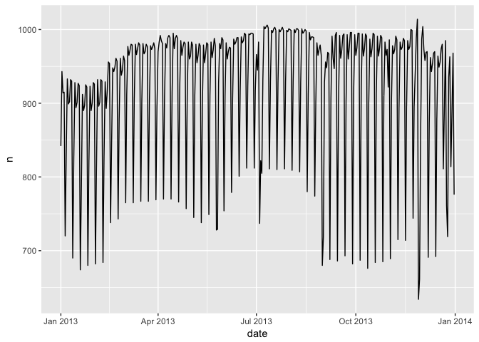
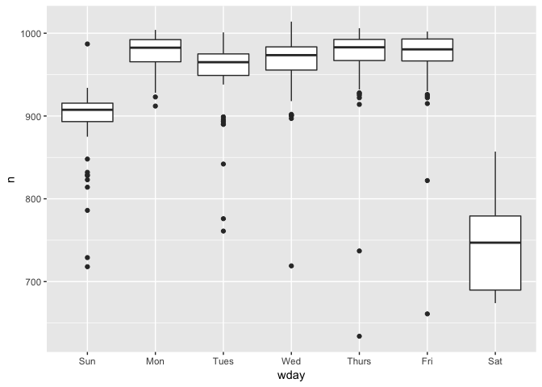
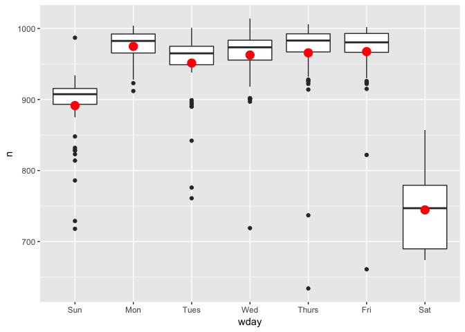
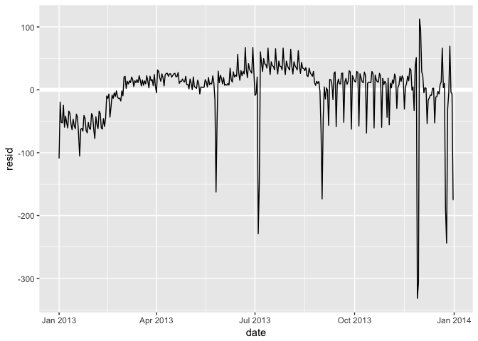
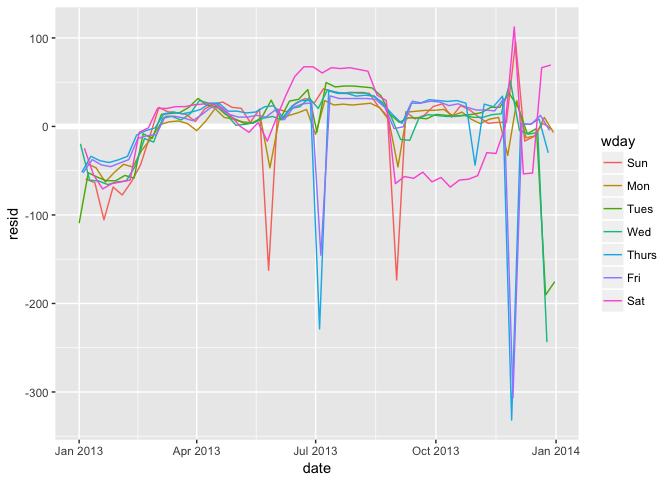
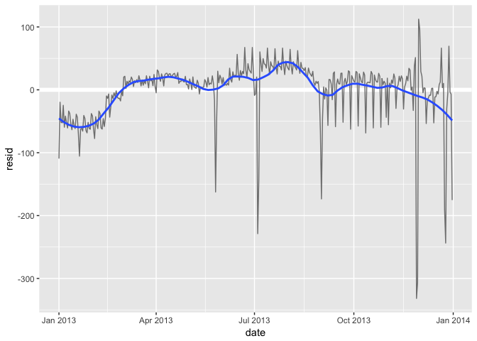
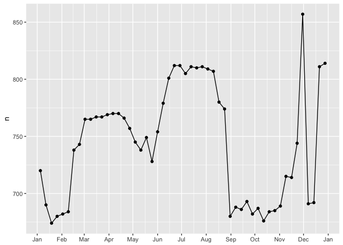
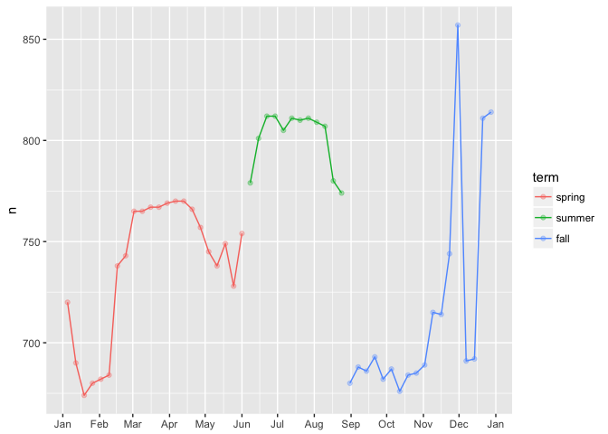

# R-Club-Nov-8


```r
library(tidyverse)
```

```
## Loading tidyverse: ggplot2
## Loading tidyverse: tibble
## Loading tidyverse: tidyr
## Loading tidyverse: readr
## Loading tidyverse: purrr
## Loading tidyverse: dplyr
```

```
## Warning: package 'dplyr' was built under R version 3.4.2
```

```
## Conflicts with tidy packages ----------------------------------------------
```

```
## filter(): dplyr, stats
## lag():    dplyr, stats
```

```r
library(modelr)
options(na.action = na.warn)
library("broom")
```

```
## 
## Attaching package: 'broom'
```

```
## The following object is masked from 'package:modelr':
## 
##     bootstrap
```

```r
library(nycflights13)
library(lubridate)
```

```
## 
## Attaching package: 'lubridate'
```

```
## The following object is masked from 'package:base':
## 
##     date
```


```r
diamonds2 <- diamonds %>% 
  filter(carat <= 2.5) %>% 
  mutate(lprice = log2(price), lcarat = log2(carat))

mod_diamond2 <- lm(lprice ~ lcarat + color + cut + clarity, data = diamonds2)
```

#24.2.3 Exercises
1.In the plot of lcarat vs. lprice, there are some bright vertical strips. What do they represent?
The distribution of diamonds has more diamonds at round or otherwise human friendly numbers (fractions).

2-If log(price) = a_0 + a_1 * log(carat), what does that say about the relationship between price and carat?
An 1% increase in carat is associated with an  a1a1 % increase in price.

3.Extract the diamonds that have very high and very low residuals. Is there anything unusual about these diamonds? Are the particularly bad or good, or do you think these are pricing errors?

4.Does the final model, mod_diamonds2, do a good job of predicting diamond prices? Would you trust it to tell you how much to spend if you were buying a diamond?


```r
diamonds2 %>% 
  add_predictions(mod_diamond2) %>%
  add_residuals(mod_diamond2) %>%
  summarise(sq_err = sqrt(mean(resid^2)),
            abs_err = mean(abs(resid)),
            p975_err = quantile(resid, 0.975),
            p025_err = quantile(resid, 0.025))
```

```
## # A tibble: 1 x 4
##     sq_err   abs_err  p975_err   p025_err
##      <dbl>     <dbl>     <dbl>      <dbl>
## 1 0.191524 0.1491158 0.3844299 -0.3692446
```

#24.3


```r
library("nycflights13")
daily <- flights %>% 
  mutate(date = make_date(year, month, day)) %>% 
  group_by(date) %>% 
  summarise(n = n())

daily
```

```
## # A tibble: 365 x 2
##          date     n
##        <date> <int>
##  1 2013-01-01   842
##  2 2013-01-02   943
##  3 2013-01-03   914
##  4 2013-01-04   915
##  5 2013-01-05   720
##  6 2013-01-06   832
##  7 2013-01-07   933
##  8 2013-01-08   899
##  9 2013-01-09   902
## 10 2013-01-10   932
## # ... with 355 more rows
```

```r
ggplot(daily, aes(date, n)) + 
  geom_line()
```

<!-- -->

24.3.1


```r
daily <- daily %>% 
  mutate(wday = wday(date, label = TRUE))
ggplot(daily, aes(wday, n)) + 
  geom_boxplot()
```

<!-- -->


```r
mod <- lm(n ~ wday, data = daily)

grid <- daily %>% 
  data_grid(wday) %>% 
  add_predictions(mod, "n")

ggplot(daily, aes(wday, n)) + 
  geom_boxplot() +
  geom_point(data = grid, colour = "red", size = 4)
```

<!-- -->


```r
daily <- daily %>% 
  add_residuals(mod)
daily %>% 
  ggplot(aes(date, resid)) + 
  geom_ref_line(h = 0) + 
  geom_line()
```

<!-- -->


```r
ggplot(daily, aes(date, resid, colour = wday)) + 
  geom_ref_line(h = 0) + 
  geom_line()
```

<!-- -->


```r
daily %>% 
  filter(resid < -100)
```

```
## # A tibble: 11 x 4
##          date     n  wday     resid
##        <date> <int> <ord>     <dbl>
##  1 2013-01-01   842  Tues -109.3585
##  2 2013-01-20   786   Sun -105.4808
##  3 2013-05-26   729   Sun -162.4808
##  4 2013-07-04   737 Thurs -228.7500
##  5 2013-07-05   822   Fri -145.4615
##  6 2013-09-01   718   Sun -173.4808
##  7 2013-11-28   634 Thurs -331.7500
##  8 2013-11-29   661   Fri -306.4615
##  9 2013-12-24   761  Tues -190.3585
## 10 2013-12-25   719   Wed -243.6923
## 11 2013-12-31   776  Tues -175.3585
```


```r
daily %>% 
  ggplot(aes(date, resid)) + 
  geom_ref_line(h = 0) + 
  geom_line(colour = "grey50") + 
  geom_smooth(se = FALSE, span = 0.20)
```

```
## `geom_smooth()` using method = 'loess'
```

<!-- -->

#24.3.2


```r
daily %>% 
  filter(wday == "Sat") %>% 
  ggplot(aes(date, n)) + 
    geom_point() + 
    geom_line() +
    scale_x_date(NULL, date_breaks = "1 month", date_labels = "%b")
```

<!-- -->


```r
term <- function(date) {
  cut(date, 
    breaks = ymd(20130101, 20130605, 20130825, 20140101),
    labels = c("spring", "summer", "fall") 
  )
}

daily <- daily %>% 
  mutate(term = term(date)) 

daily %>% 
  filter(wday == "Sat") %>% 
  ggplot(aes(date, n, colour = term)) +
  geom_point(alpha = 1/3) + 
  geom_line() +
  scale_x_date(NULL, date_breaks = "1 month", date_labels = "%b")
```

<!-- -->

