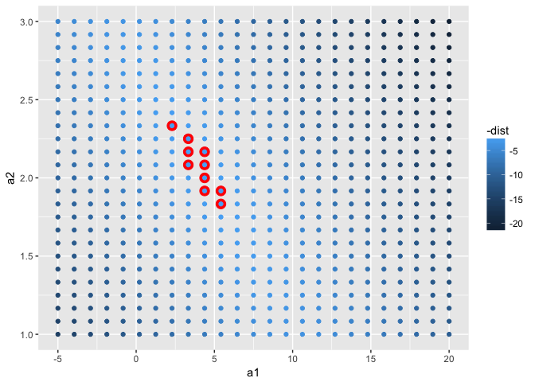
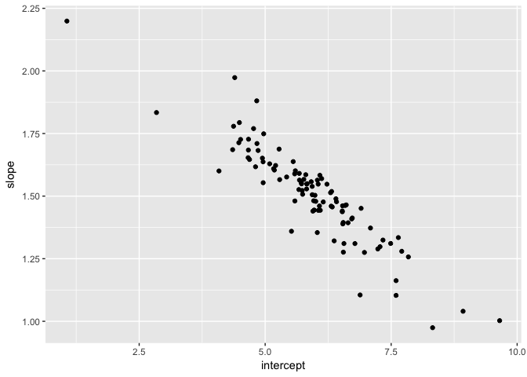

# R-Club-Sep-20


```r
#install.packages("tidyverse")

library(tidyverse)
```

```
## Loading tidyverse: ggplot2
## Loading tidyverse: tibble
## Loading tidyverse: tidyr
## Loading tidyverse: readr
## Loading tidyverse: purrr
## Loading tidyverse: dplyr
```

```
## Conflicts with tidy packages ----------------------------------------------
```

```
## filter(): dplyr, stats
## lag():    dplyr, stats
```

```r
library(modelr)
options(na.action = na.warn)
```

#23.2 A simple model


```r
ggplot(sim1, aes(x, y)) + 
  geom_point()
```

<!-- -->


```r
models <- tibble(
  a1 = runif(250, -20, 40),
  a2 = runif(250, -5, 5)
)

ggplot(sim1, aes(x, y)) + 
  geom_abline(aes(intercept = a1, slope = a2), data = models, alpha = 1/4) +
  geom_point() 
```

<!-- -->


```r
model1 <- function(a, data) {
  a[1] + data$x * a[2]
}
model1(c(7, 1.5), sim1)
```

```
##  [1]  8.5  8.5  8.5 10.0 10.0 10.0 11.5 11.5 11.5 13.0 13.0 13.0 14.5 14.5
## [15] 14.5 16.0 16.0 16.0 17.5 17.5 17.5 19.0 19.0 19.0 20.5 20.5 20.5 22.0
## [29] 22.0 22.0
```


```r
measure_distance <- function(mod, data) {
  diff <- data$y - model1(mod, data)
  sqrt(mean(diff ^ 2))
}
measure_distance(c(7, 1.5), sim1)
```

```
## [1] 2.665212
```


```r
sim1_dist <- function(a1, a2) {
  measure_distance(c(a1, a2), sim1)
}

models <- models %>% 
  mutate(dist = purrr::map2_dbl(a1, a2, sim1_dist))
models
```

```
## # A tibble: 250 x 3
##            a1         a2      dist
##         <dbl>      <dbl>     <dbl>
##  1  13.231818  2.3593594 10.949309
##  2  -1.499313 -0.4933978 21.136032
##  3   1.052334  3.4389468  6.349939
##  4  -9.521837 -1.9019021 37.319822
##  5 -19.585593  1.4382320 27.319615
##  6 -14.323648 -3.5875410 52.182411
##  7  24.374830  1.3171513 16.391120
##  8 -19.020176  2.2037566 22.508869
##  9  -7.194261 -1.2172443 30.929745
## 10  -4.495695 -0.6739424 25.056263
## # ... with 240 more rows
```


```r
ggplot(sim1, aes(x, y)) + 
  geom_point(size = 2, colour = "grey30") + 
  geom_abline(
    aes(intercept = a1, slope = a2, colour = -dist), 
    data = filter(models, rank(dist) <= 10)
  )
```

<!-- -->


```r
ggplot(models, aes(a1, a2)) +
  geom_point(data = filter(models, rank(dist) <= 10), size = 4, colour = "red") +
  geom_point(aes(colour = -dist))
```

<!-- -->

```r
grid <- expand.grid(
  a1 = seq(-5, 20, length = 25),
  a2 = seq(1, 3, length = 25)
  ) %>% 
  mutate(dist = purrr::map2_dbl(a1, a2, sim1_dist))

grid %>% 
  ggplot(aes(a1, a2)) +
  geom_point(data = filter(grid, rank(dist) <= 10), size = 4, colour = "red") +
  geom_point(aes(colour = -dist)) 
```

<!-- -->


```r
ggplot(sim1, aes(x, y)) + 
  geom_point(size = 2, colour = "grey30") + 
  geom_abline(
    aes(intercept = a1, slope = a2, colour = -dist), 
    data = filter(grid, rank(dist) <= 10)
  )
```

<!-- -->

```r
best <- optim(c(0, 0), measure_distance, data = sim1)
best$par
```

```
## [1] 4.222248 2.051204
```

```r
#> [1] 4.22 2.05

ggplot(sim1, aes(x, y)) + 
  geom_point(size = 2, colour = "grey30") + 
  geom_abline(intercept = best$par[1], slope = best$par[2])
```

<!-- -->


```r
sim1_mod <- lm(y ~ x, data = sim1)
coef(sim1_mod)
```

```
## (Intercept)           x 
##    4.220822    2.051533
```

#23.2.1 Exercises

1.One downside of the linear model is that it is sensitive to unusual values because the distance incorporates a squared term. Fit a linear model to the simulated data below, and visualise the results. Rerun a few times to generate different simulated datasets. What do you notice about the model?


```r
sim1a <- tibble(
  x = rep(1:10, each = 3),
  y = x * 1.5 + 6 + rt(length(x), df = 2)
)

lm(y ~ x, data = sim1a)
```

```
## 
## Call:
## lm(formula = y ~ x, data = sim1a)
## 
## Coefficients:
## (Intercept)            x  
##       6.715        1.458
```

```r
ggplot(sim1a, aes(x = x, y = y)) +
  geom_point() +
  geom_smooth(method = "lm", se = FALSE)
```

<!-- -->

```r
#To re-run this a few times using purrr
simt <- function(i) {
  tibble(
    x = rep(1:10, each = 3),
    y = x * 1.5 + 6 + rt(length(x), df = 2),
    .id = i
  )
}

lm_df <- function(.data) {
  mod <- lm(y ~ x, data = .data)
  beta <- coef(mod)
  tibble(intercept = beta[1], slope = beta[2])
}

sims <- map(1:100, simt) %>%
  map_df(lm_df)

ggplot(sims, aes(x = intercept, y = slope)) +
  geom_point()
```

<!-- -->

2.One way to make linear models more robust is to use a different distance measure. For example, instead of root-mean-squared distance, you could use mean-absolute distance:


```r
measure_distance <- function(mod, data) {
  diff <- data$y - make_prediction(mod, data)
  mean(abs(diff))
}

simt <- function(i) {
  tibble(
    x = rep(1:10, each = 3),
    y = x * 1.5 + 6 + rt(length(x), df = 2),
    .id = i
  )
}

lm_df <- function(.data) {
  mod <- lm(y ~ x, data = .data)
  beta <- coef(mod)
  tibble(intercept = beta[1], slope = beta[2])
}

sims <- map(1:100, simt) %>%
  map_df(lm_df)

ggplot(sims, aes(x = intercept, y = slope)) +
  geom_point()
```

<!-- -->

3.One challenge with performing numerical optimisation is that it’s only guaranteed to find one local optima. What’s the problem with optimising a three parameter model like this?


```r
model1 <- function(a, data) {
  a[1] + data$x * a[2] + a[3]
}
```
The problem is that you for any values a[1] = a1 and a[3] = a3, any other values of a[1] and a[3] where a[1] + a[3] == (a1 + a3) will have the same fit.


