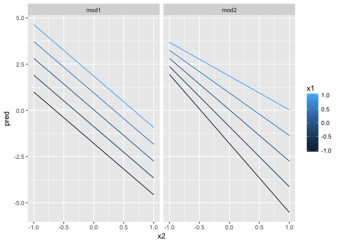

# R-Club-Sep-27


#23.3 Visualising models


```r
library(modelr)
grid <- sim1 %>% 
  data_grid(x)
```


```r
sim1_mod <- lm(y ~ x, data = sim1)

grid <- grid %>% 
  add_predictions(sim1_mod) 
grid
```

```
## # A tibble: 10 x 2
##        x      pred
##    <int>     <dbl>
##  1     1  6.272355
##  2     2  8.323888
##  3     3 10.375421
##  4     4 12.426954
##  5     5 14.478487
##  6     6 16.530020
##  7     7 18.581553
##  8     8 20.633087
##  9     9 22.684620
## 10    10 24.736153
```


```r
library(ggplot2)
ggplot(sim1, aes(x)) +
  geom_point(aes(y = y)) +
  geom_line(aes(y = pred), data = grid, colour = "red", size = 1)
```

<!-- -->

#23.3.2 Residuals


```r
sim1 <- sim1 %>% 
  add_residuals(sim1_mod)
sim1
```

```
## # A tibble: 30 x 3
##        x         y        resid
##    <int>     <dbl>        <dbl>
##  1     1  4.199913 -2.072442018
##  2     1  7.510634  1.238279125
##  3     1  2.125473 -4.146882207
##  4     2  8.988857  0.664969362
##  5     2 10.243105  1.919217378
##  6     2 11.296823  2.972935148
##  7     3  7.356365 -3.019056466
##  8     3 10.505349  0.129928252
##  9     3 10.511601  0.136179642
## 10     4 12.434589  0.007634878
## # ... with 20 more rows
```


```r
ggplot(sim1, aes(resid)) + 
  geom_freqpoly(binwidth = 0.5)
```

<!-- -->

```r
ggplot(sim1, aes(x, resid)) + 
  geom_ref_line(h = 0) +
  geom_point()
```

<!-- -->
#23.3.3 Exercises

1.Instead of using lm() to fit a straight line, you can use loess() to fit a smooth curve. Repeat the process of model fitting, grid generation, predictions, and visualisation on sim1 using loess() instead of lm(). How does the result compare to geom_smooth()?


```r
#First use add_predictions and add_residuals to add the predictions and residuals from a loess regression to the sim1 data.

sim1_loess <- loess(y ~ x, data = sim1)
grid_loess <- sim1 %>%
  add_predictions(sim1_loess)

sim1 <- sim1 %>%
  add_residuals(sim1_loess, var = "resid_loess") %>%
  add_predictions(sim1_loess, var = "pred_loess")
  
#This plots the loess predictions. The loess produces a nonlinear, but smooth line through the data.

plot_sim1_loess <- 
  ggplot(sim1, aes(x = x, y = y)) +
  geom_point() +
  geom_line(aes(x = x, y = pred), data = grid_loess, colour = "red")
plot_sim1_loess
```

<!-- -->

```r
#As we see the massege, The predictions of loess are the same as the default method for geom_smooth because geom_smooth() uses loess() by default.

plot_sim1_loess +
  geom_smooth(colour = "blue", se = FALSE, alpha = 0.20)
```

```
## `geom_smooth()` using method = 'loess'
```

<!-- -->

```r
#plot the residuals (red), and compare them to the residuals from lm (black). In general, the loess model has smaller residuals within the sample 

#ggplot(sim1, aes(x = x)) +
 # geom_ref_line(h = 0) +
 # geom_point(aes(y = resid)) +
  #geom_point(aes(y = resid_loess), colour = "red") why Error in FUN(X[[i]], ...) : object 'resid_loess' not found?
```

2.add_predictions() is paired with gather_predictions() and spread_predictions(). How do these three functions differ?

The functions gather_predictions and spread_predictions allow for adding predictions from multiple models at once.

3.What does geom_ref_line() do? What package does it come from? Why is displaying a reference 
line in plots showing residuals useful and important?

The geom geom_ref_line() adds as reference line to a plot. Even though it alters a ggplot2 plot, it is in the modelr package. Putting a reference line at zero for residuals is important because good models should have residuals centered at zero, with approximately the same variance (or distribution) over the support of x, and no correlation. A zero reference line makes it easier to judge these characteristics visually.

4.Why might you want to look at a frequency polygon of absolute residuals? What are the pros and cons compared to looking at the raw residuals?

The frequency polygon makes it easier to judge whether the variance or absolute size of the residuals varies with respect to x. 

#23.4 Formulas and model families


```r
library(tibble)
df <- tribble(
  ~y, ~x1, ~x2,
  4, 2, 5,
  5, 1, 6
)
model_matrix(df, y ~ x1)
```

```
## # A tibble: 2 x 2
##   `(Intercept)`    x1
##           <dbl> <dbl>
## 1             1     2
## 2             1     1
```

```r
model_matrix(df, y ~ x2)
```

```
## # A tibble: 2 x 2
##   `(Intercept)`    x2
##           <dbl> <dbl>
## 1             1     5
## 2             1     6
```


```r
model_matrix(df, y ~ x1 - 1)
```

```
## # A tibble: 2 x 1
##      x1
##   <dbl>
## 1     2
## 2     1
```

#23.4.1 Categorical variables


```r
df <- tribble(
  ~ sex, ~ response,
  "male", 1,
  "female", 2,
  "male", 1
)
model_matrix(df, response ~ sex)
```

```
## # A tibble: 3 x 2
##   `(Intercept)` sexmale
##           <dbl>   <dbl>
## 1             1       1
## 2             1       0
## 3             1       1
```


```r
ggplot(sim2) + 
  geom_point(aes(x, y))
```

<!-- -->


```r
mod2 <- lm(y ~ x, data = sim2)

grid <- sim2 %>% 
  data_grid(x) %>% 
  add_predictions(mod2)
grid
```

```
## # A tibble: 4 x 2
##       x     pred
##   <chr>    <dbl>
## 1     a 1.152166
## 2     b 8.116039
## 3     c 6.127191
## 4     d 1.910981
```


```r
ggplot(sim2, aes(x)) + 
  geom_point(aes(y = y)) +
  geom_point(data = grid, aes(y = pred), colour = "red", size = 4)
```

<!-- -->


```r
#tibble(x = "e") %>% 
#  add_predictions(mod2)
#got error
```

#23.4.2 Interactions (continuous and categorical)

```r
ggplot(sim3, aes(x1, y)) + 
  geom_point(aes(colour = x2))
```

<!-- -->


```r
mod1 <- lm(y ~ x1 + x2, data = sim3)
mod2 <- lm(y ~ x1 * x2, data = sim3)
```


```r
grid <- sim3 %>% 
  data_grid(x1, x2) %>% 
  gather_predictions(mod1, mod2)
grid
```

```
## # A tibble: 80 x 4
##    model    x1     x2     pred
##    <chr> <int> <fctr>    <dbl>
##  1  mod1     1      a 1.674928
##  2  mod1     1      b 4.562739
##  3  mod1     1      c 6.480664
##  4  mod1     1      d 4.034515
##  5  mod1     2      a 1.478190
##  6  mod1     2      b 4.366001
##  7  mod1     2      c 6.283926
##  8  mod1     2      d 3.837777
##  9  mod1     3      a 1.281453
## 10  mod1     3      b 4.169263
## # ... with 70 more rows
```


```r
#ggplot(sim3, aes(x1, y, colour = x2)) + 
 # geom_point() + 
 # geom_line(data = grid, aes(y = pred)) + 
 # facet_wrap(~ model)
#not worked???
```


```r
sim3 <- sim3 %>% 
  gather_residuals(mod1, mod2)

ggplot(sim3, aes(x1, resid, colour = x2)) + 
  geom_point() + 
  facet_grid(model ~ x2)
```

<!-- -->

#23.4.3 Interactions (two continuous)

```r
mod1 <- lm(y ~ x1 + x2, data = sim4)
mod2 <- lm(y ~ x1 * x2, data = sim4)

grid <- sim4 %>% 
  data_grid(
    x1 = seq_range(x1, 5), 
    x2 = seq_range(x2, 5) 
  ) %>% 
  gather_predictions(mod1, mod2)
grid
```

```
## # A tibble: 50 x 4
##    model    x1    x2       pred
##    <chr> <dbl> <dbl>      <dbl>
##  1  mod1  -1.0  -1.0  0.9963094
##  2  mod1  -1.0  -0.5 -0.3949484
##  3  mod1  -1.0   0.0 -1.7862061
##  4  mod1  -1.0   0.5 -3.1774639
##  5  mod1  -1.0   1.0 -4.5687216
##  6  mod1  -0.5  -1.0  1.9071424
##  7  mod1  -0.5  -0.5  0.5158847
##  8  mod1  -0.5   0.0 -0.8753731
##  9  mod1  -0.5   0.5 -2.2666308
## 10  mod1  -0.5   1.0 -3.6578886
## # ... with 40 more rows
```


```r
seq_range(c(0.0123, 0.923423), n = 5)
```

```
## [1] 0.0123000 0.2400808 0.4678615 0.6956423 0.9234230
```

```r
seq_range(c(0.0123, 0.923423), n = 5, pretty = TRUE)
```

```
## [1] 0.0 0.2 0.4 0.6 0.8 1.0
```


```r
x1 <- rcauchy(100)
seq_range(x1, n=5)
```

```
## [1] -12.836964  -5.838053   1.160859   8.159770  15.158682
```

```r
seq_range(x1, n=5, trim=0.10)
```

```
## [1] -3.166826 -1.590427 -0.014028  1.562371  3.138770
```

```r
seq_range(x1, n=5, trim=0.25)
```

```
## [1] -1.8863604 -1.0348591 -0.1833578  0.6681436  1.5196449
```

```r
seq_range(x1, n=5 , trim = 0.50)
```

```
## [1] -0.80940266 -0.44177425 -0.07414583  0.29348258  0.66111100
```

```r
x2 <- c(0, 1)
seq_range(x2, n = 5)
```

```
## [1] 0.00 0.25 0.50 0.75 1.00
```

```r
#> [1] 0.00 0.25 0.50 0.75 1.00
seq_range(x2, n = 5, expand = 0.10)
```

```
## [1] -0.050  0.225  0.500  0.775  1.050
```

```r
#> [1] -0.050  0.225  0.500  0.775  1.050
seq_range(x2, n = 5, expand = 0.25)
```

```
## [1] -0.1250  0.1875  0.5000  0.8125  1.1250
```

```r
#> [1] -0.125  0.188  0.500  0.812  1.125
seq_range(x2, n = 5, expand = 0.50)
```

```
## [1] -0.250  0.125  0.500  0.875  1.250
```

```r
#> [1] -0.250  0.125  0.500  0.875  1.250
```


```r
ggplot(grid, aes(x1, x2)) + 
  geom_tile(aes(fill = pred)) + 
  facet_wrap(~ model)
```

<!-- -->

```r
ggplot(grid, aes(x1, pred, colour = x2, group = x2)) + 
  geom_line() +
  facet_wrap(~ model)
```

<!-- -->

```r
ggplot(grid, aes(x2, pred, colour = x1, group = x1)) + 
  geom_line() +
  facet_wrap(~ model)
```

<!-- -->

#19.4 Formulas and Model Families

```r
df <- tribble(
  ~y, ~x1, ~x2,
  4, 2, 5,
  5, 1, 6
)
```
#23.4.4 Transformations


```r
df <- tribble(
  ~y, ~x,
   1,  1,
   2,  2, 
   3,  3
)
model_matrix(df,y ~ x^2 + x)
```

```
## # A tibble: 3 x 2
##   `(Intercept)`     x
##           <dbl> <dbl>
## 1             1     1
## 2             1     2
## 3             1     3
```

```r
model_matrix(df, y ~ I(x^2) + x)
```

```
## # A tibble: 3 x 3
##   `(Intercept)` `I(x^2)`     x
##           <dbl>    <dbl> <dbl>
## 1             1        1     1
## 2             1        4     2
## 3             1        9     3
```

```r
model_matrix(df, y ~ poly(x, 2))
```

```
## # A tibble: 3 x 3
##   `(Intercept)` `poly(x, 2)1` `poly(x, 2)2`
##           <dbl>         <dbl>         <dbl>
## 1             1 -7.071068e-01     0.4082483
## 2             1 -7.850462e-17    -0.8164966
## 3             1  7.071068e-01     0.4082483
```

```r
library(splines)
model_matrix(df, y ~ ns(x, 2))
```

```
## # A tibble: 3 x 3
##   `(Intercept)` `ns(x, 2)1` `ns(x, 2)2`
##           <dbl>       <dbl>       <dbl>
## 1             1   0.0000000   0.0000000
## 2             1   0.5662628  -0.2108419
## 3             1   0.3440969   0.7706021
```


```r
sim5 <- tibble(
  x = seq(0, 3.5 * pi, length = 50),
  y = 4 * sin(x) + rnorm(length(x))
)

ggplot(sim5, aes(x, y)) +
  geom_point()
```

<!-- -->


```r
mod1 <- lm(y ~ ns(x, 1), data = sim5)
mod2 <- lm(y ~ ns(x, 2), data = sim5)
mod3 <- lm(y ~ ns(x, 3), data = sim5)
mod4 <- lm(y ~ ns(x, 4), data = sim5)
mod5 <- lm(y ~ ns(x, 5), data = sim5)

grid <- sim5 %>% 
  data_grid(x = seq_range(x, n = 50, expand = 0.1)) %>% 
  gather_predictions(mod1, mod2, mod3, mod4, mod5, .pred = "y")

ggplot(sim5, aes(x, y)) + 
  geom_point() +
  geom_line(data = grid, colour = "red") +
  facet_wrap(~ model)
```

<!-- -->

#23.4.5 Exercises

1.What happens if you repeat the analysis of sim2 using a model without an intercept. What happens to the model equation? What happens to the predictions?

2.Use model_matrix() to explore the equations generated for the models I fit to sim3 and sim4. Why is * a good shorthand for interaction?

3.Using the basic principles, convert the formulas in the following two models into functions. (Hint: start by converting the categorical variable into 0-1 variables.)

mod1 <- lm(y ~ x1 + x2, data = sim3)
mod2 <- lm(y ~ x1 * x2, data = sim3)

4.For sim4, which of mod1 and mod2 is better? I think mod2 does a slightly better job at removing patterns, but it’s pretty subtle. Can you come up with a plot to support my claim?

#23.5 Missing values


```r
df <- tribble(
  ~x, ~y,
  1, 2.2,
  2, NA,
  3, 3.5,
  4, 8.3,
  NA, 10
)

mod <- lm(y ~ x, data = df)
```


```r
mod <- lm(y ~ x, data = df, na.action = na.exclude)
```


```r
nobs(mod)
```

```
## [1] 3
```

#23.6 Other model families


