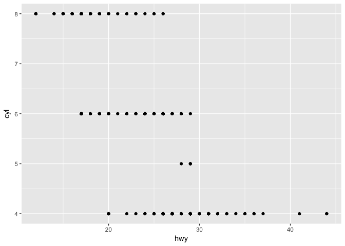
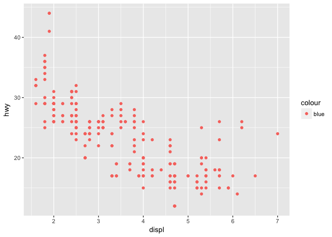
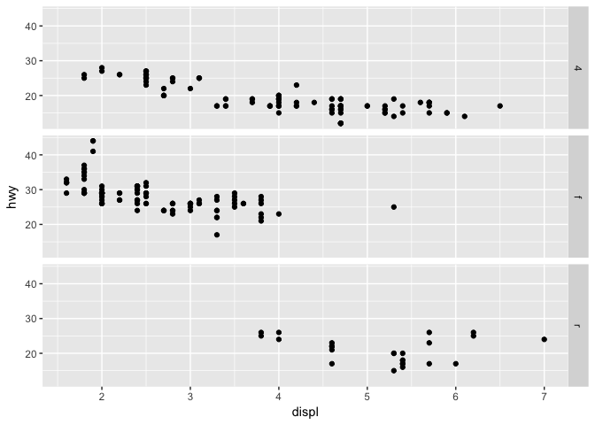

# R-club-Apr-26
#3.1.1 Prerequisites

```r
#install.packages(tidyverse)
library(tidyverse)
```

```
## Warning: package 'tidyverse' was built under R version 3.3.2
```

```
## Loading tidyverse: ggplot2
## Loading tidyverse: tibble
## Loading tidyverse: tidyr
## Loading tidyverse: readr
## Loading tidyverse: purrr
## Loading tidyverse: dplyr
```

```
## Warning: package 'ggplot2' was built under R version 3.3.2
```

```
## Warning: package 'tidyr' was built under R version 3.3.2
```

```
## Warning: package 'readr' was built under R version 3.3.2
```

```
## Conflicts with tidy packages ----------------------------------------------
```

```
## filter(): dplyr, stats
## lag():    dplyr, stats
```

```r
library(ggplot2)
```
#3.2.2 Creating a ggplot

```r
mpg
```

```
## # A tibble: 234 × 11
##    manufacturer      model displ  year   cyl      trans   drv   cty   hwy
##           <chr>      <chr> <dbl> <int> <int>      <chr> <chr> <int> <int>
## 1          audi         a4   1.8  1999     4   auto(l5)     f    18    29
## 2          audi         a4   1.8  1999     4 manual(m5)     f    21    29
## 3          audi         a4   2.0  2008     4 manual(m6)     f    20    31
## 4          audi         a4   2.0  2008     4   auto(av)     f    21    30
## 5          audi         a4   2.8  1999     6   auto(l5)     f    16    26
## 6          audi         a4   2.8  1999     6 manual(m5)     f    18    26
## 7          audi         a4   3.1  2008     6   auto(av)     f    18    27
## 8          audi a4 quattro   1.8  1999     4 manual(m5)     4    18    26
## 9          audi a4 quattro   1.8  1999     4   auto(l5)     4    16    25
## 10         audi a4 quattro   2.0  2008     4 manual(m6)     4    20    28
## # ... with 224 more rows, and 2 more variables: fl <chr>, class <chr>
```

```r
ggplot(data = mpg) + 
  geom_point(mapping = aes(x = displ, y = hwy))
```

<!-- -->
#3.2.3 A graphing template
##3.2.4 Exercises
###1

```r
ggplot(data = mpg)# I see nothing
```

<!-- -->
###2

```r
dim(mtcars) # 32 11 number of row equal to "32" & number of col equal to "11"
```

```
## [1] 32 11
```

```r
ncol(mtcars) #number of col equal to "11"
```

```
## [1] 11
```
###3

```r
?mpg
#$f describe front-wheel drive, r = rear wheel drive, 4 = 4wd
```
###4

```r
ggplot(data = mpg) + geom_point(mapping = aes(x = hwy, y = cyl))
```

<!-- -->
###5

```r
ggplot(data = mpg) + geom_point(mapping = aes(x = class, y = drv))#it has no  meaning to me
```

<!-- -->
#3.3 Aesthetic mappings
##3.3.1 Exercises
###1

```r
ggplot(data = mpg) + 
  geom_point(mapping = aes(x = displ, y = hwy, color = "blue"))
```

<!-- -->

```r
#in this function the colour does not change, if I want to change the color it must not be in aes()
```
###2

```r
?mpg
mpg
```

```
## # A tibble: 234 × 11
##    manufacturer      model displ  year   cyl      trans   drv   cty   hwy
##           <chr>      <chr> <dbl> <int> <int>      <chr> <chr> <int> <int>
## 1          audi         a4   1.8  1999     4   auto(l5)     f    18    29
## 2          audi         a4   1.8  1999     4 manual(m5)     f    21    29
## 3          audi         a4   2.0  2008     4 manual(m6)     f    20    31
## 4          audi         a4   2.0  2008     4   auto(av)     f    21    30
## 5          audi         a4   2.8  1999     6   auto(l5)     f    16    26
## 6          audi         a4   2.8  1999     6 manual(m5)     f    18    26
## 7          audi         a4   3.1  2008     6   auto(av)     f    18    27
## 8          audi a4 quattro   1.8  1999     4 manual(m5)     4    18    26
## 9          audi a4 quattro   1.8  1999     4   auto(l5)     4    16    25
## 10         audi a4 quattro   2.0  2008     4 manual(m6)     4    20    28
## # ... with 224 more rows, and 2 more variables: fl <chr>, class <chr>
```

```r
#manufacturer,model,trans,drv, fl, and class are categorials
##displ, year, cyl, cty, and hwy are continuous
# also we can check this with see the distribution 
hist(mpg$displ) # as categorials
```

<!-- -->

```r
hist(mpg$hwy)# as continuous normal distribution
```

<!-- -->
###3

```r
#color
mpg
```

```
## # A tibble: 234 × 11
##    manufacturer      model displ  year   cyl      trans   drv   cty   hwy
##           <chr>      <chr> <dbl> <int> <int>      <chr> <chr> <int> <int>
## 1          audi         a4   1.8  1999     4   auto(l5)     f    18    29
## 2          audi         a4   1.8  1999     4 manual(m5)     f    21    29
## 3          audi         a4   2.0  2008     4 manual(m6)     f    20    31
## 4          audi         a4   2.0  2008     4   auto(av)     f    21    30
## 5          audi         a4   2.8  1999     6   auto(l5)     f    16    26
## 6          audi         a4   2.8  1999     6 manual(m5)     f    18    26
## 7          audi         a4   3.1  2008     6   auto(av)     f    18    27
## 8          audi a4 quattro   1.8  1999     4 manual(m5)     4    18    26
## 9          audi a4 quattro   1.8  1999     4   auto(l5)     4    16    25
## 10         audi a4 quattro   2.0  2008     4 manual(m6)     4    20    28
## # ... with 224 more rows, and 2 more variables: fl <chr>, class <chr>
```

```r
ggplot(data = mpg) + 
  geom_point(mapping = aes(x = displ, y = hwy, color = cyl))
```

<!-- -->

```r
#since colors are continuous, so it is hard to explain the difference between continuous variables
###size
ggplot(data = mpg) + 
  geom_point(mapping = aes(x = displ, y = hwy, size = cyl))
```

<!-- -->

```r
###shape
#mpg #it is wrong the continuous variable can not be mapped to shape
#ggplot(data = mpg) + 
#geom_point(mapping = aes(x = displ, y = hwy, shape = class))
```
###4

```r
ggplot(data = mpg) + 
  geom_point(mapping = aes(x = cyl, y = cyl, color = cyl))
```

<!-- -->

```r
# I get a nice  correlation line
```
###5

```r
ggplot(data = mpg) + 
  geom_point(mapping = aes(x = displ, y = hwy,color = model), stroke = 1)
```

<!-- -->

```r
?geom_point
#change the size of the points in the plot
```
###6

```r
ggplot(data = mpg) + 
  geom_point(mapping = aes(x = cyl, y = hwy,color = cyl < 5), stroke = 1)
```

<!-- -->
#3.4 Common problems
#3.5 Facets
##3.5.1 Exercises
###1.What happens if you facet on a continuous variable?

```r
ggplot(data = mpg) + 
  geom_point(mapping = aes(x = displ, y = hwy)) + 
  facet_wrap(~ cyl, nrow = 2)
```

<!-- -->
###2.What do the empty cells in plot with facet_grid(drv ~ cyl) mean? How do they relate to this plot?

```r
ggplot(data = mpg) + 
  geom_point(mapping = aes(x = drv, y = cyl))
```

<!-- -->

```r
#there are no points for x and y combination such as there are no points fordrv= 4 and cyl=5
```
###3.What plots does the following code make? What does . do?

```r
ggplot(data = mpg) + 
  geom_point(mapping = aes(x = displ, y = hwy)) +
  facet_grid(drv ~ .)
```

<!-- -->

```r
#facet only in y axis
ggplot(data = mpg) + 
  geom_point(mapping = aes(x = displ, y = hwy)) +
  facet_grid(. ~ cyl)
```

<!-- -->

```r
#facet only in x axis
```
###4.Take the first faceted plot in this section
###What are the advantages to using faceting instead of the colour aesthetic? What are the disadvantages?

```r
ggplot(data = mpg) + 
  geom_point(mapping = aes(x = displ, y = hwy, color=class)) + 
  facet_wrap(~ class, nrow = 2)
```

<!-- -->

```r
#Advantages: if I have a large data for analyzing it is easy to use colour as we can see in this function. also this function give us more information #disadvantages: becuase we don't have a largest dataset there is no strong negative relationship between displ and hwy
### How might the balance change if you had a larger dataset?
#Each figure may have a strong negative relationships between displ and hwy.

###5.Read ?facet_wrap. What does nrow do? What does ncol do? 
#nrow represented num of rpws and ncol represented the number of columns in facet_warp.
###5.What other options control the layout of the individual panels? 
#threre are several options such as  labeller, as.table
#Try as.table. If the default TRUE, the facets look like a table with highest values at the bottom-right. If FALSE, the facets look like a plot with the highest value at the top-right.
#5.Why doesn’t facet_grid() have nrow and ncol variables?
##it was faceted according to the levels of variables. The number of rows or columns were determined by the levels of the variable.

###6.When using facet_grid() you should usually put the variable with more unique levels in the columns. Why?
?facet_grid
#if put variables with less unique levels, the plots would have many grids so it would not be appropriate for understanding.
```
