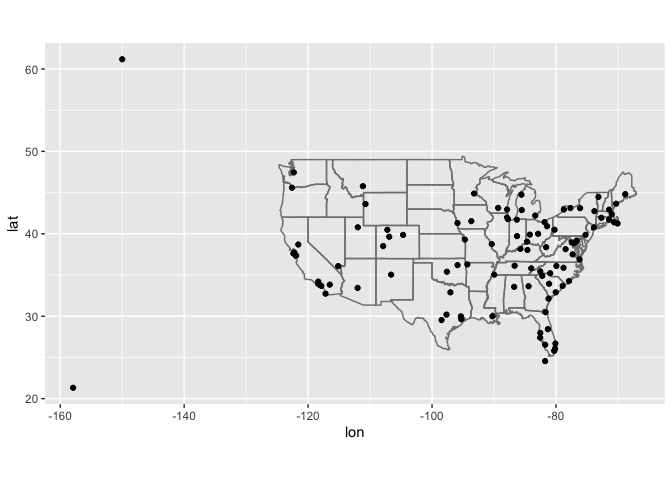

# R-club-28-Jun
Hajar  
6/28/2017  
#13.3 Keys

```r
library(tidyverse)
```

```
## Warning: package 'tidyverse' was built under R version 3.2.5
```

```
## Loading tidyverse: ggplot2
## Loading tidyverse: tibble
## Loading tidyverse: tidyr
## Loading tidyverse: readr
## Loading tidyverse: purrr
## Loading tidyverse: dplyr
```

```
## Warning: package 'ggplot2' was built under R version 3.2.5
```

```
## Warning: package 'tibble' was built under R version 3.2.5
```

```
## Warning: package 'tidyr' was built under R version 3.2.5
```

```
## Warning: package 'purrr' was built under R version 3.2.5
```

```
## Warning: package 'dplyr' was built under R version 3.2.5
```

```
## Conflicts with tidy packages ----------------------------------------------
```

```
## filter(): dplyr, stats
## lag():    dplyr, stats
```

```r
library(nycflights13)
planes %>% 
  count(tailnum) %>% 
  filter(n > 1)
```

```
## # A tibble: 0 × 2
## # ... with 2 variables: tailnum <chr>, n <int>
```

```r
weather %>% 
  count(year, month, day, hour, origin) %>% 
  filter(n > 1)
```

```
## Source: local data frame [0 x 6]
## Groups: month, day, hour, year [0]
## 
## # ... with 6 variables: month <dbl>, day <int>, hour <int>, year <dbl>,
## #   origin <chr>, n <int>
```

#13.3.1 Exercises
1.Add a surrogate key to flights.
I add the column flight_id as a surrogate key.

```r
flights %>% 
  arrange(year, month, day, dep_time, carrier, flight) %>%
  mutate(flight_id = row_number()) %>%
  glimpse()
```

```
## Observations: 336,776
## Variables: 17
## $ year      <int> 2013, 2013, 2013, 2013, 2013, 2013, 2013, 2013, 2013...
## $ month     <int> 1, 1, 1, 1, 1, 1, 1, 1, 1, 1, 1, 1, 1, 1, 1, 1, 1, 1...
## $ day       <int> 1, 1, 1, 1, 1, 1, 1, 1, 1, 1, 1, 1, 1, 1, 1, 1, 1, 1...
## $ dep_time  <int> 517, 533, 542, 544, 554, 554, 555, 557, 557, 558, 55...
## $ dep_delay <dbl> 2, 4, 2, -1, -6, -4, -5, -3, -3, -2, -2, -2, -2, -2,...
## $ arr_time  <int> 830, 850, 923, 1004, 812, 740, 913, 838, 709, 753, 8...
## $ arr_delay <dbl> 11, 20, 33, -18, -25, 12, 19, -8, -14, 8, -2, -3, 7,...
## $ carrier   <chr> "UA", "UA", "AA", "B6", "DL", "UA", "B6", "B6", "EV"...
## $ tailnum   <chr> "N14228", "N24211", "N619AA", "N804JB", "N668DN", "N...
## $ flight    <int> 1545, 1714, 1141, 725, 461, 1696, 507, 79, 5708, 301...
## $ origin    <chr> "EWR", "LGA", "JFK", "JFK", "LGA", "EWR", "EWR", "JF...
## $ dest      <chr> "IAH", "IAH", "MIA", "BQN", "ATL", "ORD", "FLL", "MC...
## $ air_time  <dbl> 227, 227, 160, 183, 116, 150, 158, 140, 53, 138, 149...
## $ distance  <dbl> 1400, 1416, 1089, 1576, 762, 719, 1065, 944, 229, 73...
## $ hour      <dbl> 5, 5, 5, 5, 5, 5, 5, 5, 5, 5, 5, 5, 5, 5, 5, 5, 5, 6...
## $ minute    <dbl> 17, 33, 42, 44, 54, 54, 55, 57, 57, 58, 58, 58, 58, ...
## $ flight_id <int> 1, 2, 3, 4, 5, 6, 7, 8, 9, 10, 11, 12, 13, 14, 15, 1...
```

2.Identify the keys in the following datasets

Lahman::Batting,
babynames::babynames
nasaweather::atmos
fueleconomy::vehicles
ggplot2::diamonds


```r
#The primary key for Lahman::Batting is playerID, yearID, stint
Lahman::Batting %>%
  group_by(playerID, yearID, stint) %>%
  filter(n() > 1) %>%
  nrow()
```

```
## [1] 0
```

```r
#install.packages("babynames")
library(babynames)
```

```
## Warning: package 'babynames' was built under R version 3.2.5
```

```r
babynames::babynames %>%
  group_by(year, sex, name) %>%
  filter(n() > 1) %>%
  nrow()
```

```
## [1] 0
```

```r
#install.packages("nasaweather")
nasaweather::atmos %>%
  group_by(lat, long, year, month) %>%
  filter(n() > 1) %>%
  nrow()
```

```
## [1] 0
```

```r
#install.packages("fueleconomy")
fueleconomy::vehicles %>%
  group_by(id) %>%
  filter(n() > 1) %>%
  nrow()
```

```
## [1] 0
```

```r
#here is no primary key for ggplot2::diamonds. Using all variables in the data frame,
#the number of distinct rows is lower than the total number of rows.(no combination of variabl)

ggplot2::diamonds %>%
  distinct() %>% 
  nrow()
```

```
## [1] 53794
```

```r
nrow(ggplot2::diamonds)
```

```
## [1] 53940
```
3.Draw a diagram illustrating the connections between the Batting, Master, and Salaries tables in the Lahman package. Draw another diagram that shows the relationship between Master, Managers, AwardsManagers.

How would you characterise the relationship between the Batting, Pitching, and Fielding tables?

-Batting
primary key: playerID, yearID, stint
foreign keys:
  playerID -> Master.playerID
-Master
primary key: playerID
-Salaries
primary key: yearID, teamID, playerID
foreign keys:
  playerID -> Master.playerID
-Managers:
  primary key: yearID, playerID, teamID, inseason
foreign keys:
  playerID -> Master.teamID
Managers:
  primary key: awardID, yearID
-AwardsManagers:
  primary key: playerID, awardID, yearID (since there are ties and while tie distinguishes those awards it has NA values)
foreign keys:
  playerID -> Master.playerID
playerID, yearID, lgID -> Managers.playerID, yearID, lgID

#13.4 Mutating joins

```r
flights2 <- flights %>% 
  select(year:day, hour, origin, dest, tailnum, carrier)
flights2
```

```
## # A tibble: 336,776 × 8
##     year month   day  hour origin  dest tailnum carrier
##    <int> <int> <int> <dbl>  <chr> <chr>   <chr>   <chr>
## 1   2013     1     1     5    EWR   IAH  N14228      UA
## 2   2013     1     1     5    LGA   IAH  N24211      UA
## 3   2013     1     1     5    JFK   MIA  N619AA      AA
## 4   2013     1     1     5    JFK   BQN  N804JB      B6
## 5   2013     1     1     5    LGA   ATL  N668DN      DL
## 6   2013     1     1     5    EWR   ORD  N39463      UA
## 7   2013     1     1     5    EWR   FLL  N516JB      B6
## 8   2013     1     1     5    LGA   IAD  N829AS      EV
## 9   2013     1     1     5    JFK   MCO  N593JB      B6
## 10  2013     1     1     5    LGA   ORD  N3ALAA      AA
## # ... with 336,766 more rows
```

```r
#flights2 %>%
  #select(-origin, -dest) %>% 
  #left_join(airlines, by = "carrier")

flights2 %>%
  select(-origin, -dest) %>% 
  mutate(name = airlines$name[match(carrier, airlines$carrier)])
```

```
## # A tibble: 336,776 × 7
##     year month   day  hour tailnum carrier                     name
##    <int> <int> <int> <dbl>   <chr>   <chr>                   <fctr>
## 1   2013     1     1     5  N14228      UA    United Air Lines Inc.
## 2   2013     1     1     5  N24211      UA    United Air Lines Inc.
## 3   2013     1     1     5  N619AA      AA   American Airlines Inc.
## 4   2013     1     1     5  N804JB      B6          JetBlue Airways
## 5   2013     1     1     5  N668DN      DL     Delta Air Lines Inc.
## 6   2013     1     1     5  N39463      UA    United Air Lines Inc.
## 7   2013     1     1     5  N516JB      B6          JetBlue Airways
## 8   2013     1     1     5  N829AS      EV ExpressJet Airlines Inc.
## 9   2013     1     1     5  N593JB      B6          JetBlue Airways
## 10  2013     1     1     5  N3ALAA      AA   American Airlines Inc.
## # ... with 336,766 more rows
```
#13.4.1 Understanding joins

```r
x <- tribble(
  ~key, ~val_x,
  1, "x1",
  2, "x2",
  3, "x3"
)
y <- tribble(
  ~key, ~val_y,
  1, "y1",
  2, "y2",
  4, "y3"
)
```
#13.4.2 Inner join

```r
x %>% 
  inner_join(y, by = "key")
```

```
## # A tibble: 2 × 3
##     key val_x val_y
##   <dbl> <chr> <chr>
## 1     1    x1    y1
## 2     2    x2    y2
```
#13.4.3 Outer joins
#13.4.4 Duplicate keys

```r
x <- tribble(
  ~key, ~val_x,
  1, "x1",
  2, "x2",
  2, "x3",
  1, "x4"
)

y <- tribble(
  ~key, ~val_y,
  1, "y1",
  2, "y2"
)
left_join(x, y, by = "key")
```

```
## # A tibble: 4 × 3
##     key val_x val_y
##   <dbl> <chr> <chr>
## 1     1    x1    y1
## 2     2    x2    y2
## 3     2    x3    y2
## 4     1    x4    y1
```


```r
x <- tribble(
  ~key, ~val_x,
  1, "x1",
  2, "x2",
  2, "x3",
  3, "x4"
)
y <- tribble(
  ~key, ~val_y,
  1, "y1",
  2, "y2",
  2, "y3",
  3, "y4"
)
left_join(x, y, by = "key")
```

```
## # A tibble: 6 × 3
##     key val_x val_y
##   <dbl> <chr> <chr>
## 1     1    x1    y1
## 2     2    x2    y2
## 3     2    x2    y3
## 4     2    x3    y2
## 5     2    x3    y3
## 6     3    x4    y4
```
#13.4.5 Defining the key columns

```r
flights2 %>% 
  left_join(weather)
```

```
## Joining, by = c("year", "month", "day", "hour", "origin")
```

```
## # A tibble: 336,776 × 17
##     year month   day  hour origin  dest tailnum carrier  temp  dewp humid
##    <dbl> <dbl> <int> <dbl>  <chr> <chr>   <chr>   <chr> <dbl> <dbl> <dbl>
## 1   2013     1     1     5    EWR   IAH  N14228      UA    NA    NA    NA
## 2   2013     1     1     5    LGA   IAH  N24211      UA    NA    NA    NA
## 3   2013     1     1     5    JFK   MIA  N619AA      AA    NA    NA    NA
## 4   2013     1     1     5    JFK   BQN  N804JB      B6    NA    NA    NA
## 5   2013     1     1     5    LGA   ATL  N668DN      DL    NA    NA    NA
## 6   2013     1     1     5    EWR   ORD  N39463      UA    NA    NA    NA
## 7   2013     1     1     5    EWR   FLL  N516JB      B6    NA    NA    NA
## 8   2013     1     1     5    LGA   IAD  N829AS      EV    NA    NA    NA
## 9   2013     1     1     5    JFK   MCO  N593JB      B6    NA    NA    NA
## 10  2013     1     1     5    LGA   ORD  N3ALAA      AA    NA    NA    NA
## # ... with 336,766 more rows, and 6 more variables: wind_dir <dbl>,
## #   wind_speed <dbl>, wind_gust <dbl>, precip <dbl>, pressure <dbl>,
## #   visib <dbl>
```

```r
flights2 %>% 
  left_join(airports, c("dest" = "faa"))
```

```
## # A tibble: 336,776 × 14
##     year month   day  hour origin  dest tailnum carrier
##    <int> <int> <int> <dbl>  <chr> <chr>   <chr>   <chr>
## 1   2013     1     1     5    EWR   IAH  N14228      UA
## 2   2013     1     1     5    LGA   IAH  N24211      UA
## 3   2013     1     1     5    JFK   MIA  N619AA      AA
## 4   2013     1     1     5    JFK   BQN  N804JB      B6
## 5   2013     1     1     5    LGA   ATL  N668DN      DL
## 6   2013     1     1     5    EWR   ORD  N39463      UA
## 7   2013     1     1     5    EWR   FLL  N516JB      B6
## 8   2013     1     1     5    LGA   IAD  N829AS      EV
## 9   2013     1     1     5    JFK   MCO  N593JB      B6
## 10  2013     1     1     5    LGA   ORD  N3ALAA      AA
## # ... with 336,766 more rows, and 6 more variables: name <chr>, lat <dbl>,
## #   lon <dbl>, alt <int>, tz <dbl>, dst <chr>
```

#13.4.6 Exercises

1.Compute the average delay by destination, then join on the airports data frame so you can show the spatial distribution of delays. Here’s an easy way to draw a map of the United States:


```r
airports %>%
  semi_join(flights, c("faa" = "dest")) %>%
  ggplot(aes(lon, lat)) +
    borders("state") +
    geom_point() +
    coord_quickmap()
```

```
## 
##  # ATTENTION: maps v3.0 has an updated 'world' map.        #
##  # Many country borders and names have changed since 1990. #
##  # Type '?world' or 'news(package="maps")'. See README_v3. #
```

```
## 
## Attaching package: 'maps'
```

```
## The following object is masked from 'package:purrr':
## 
##     map
```

<!-- -->


```r
avg_dest_delays <-
  flights %>%
  group_by(dest) %>%
  # arrival delay NA's are cancelled flights
  summarise(delay = mean(arr_delay, na.rm = TRUE)) %>%
  inner_join(airports, by = c(dest = "faa"))

avg_dest_delays %>%
  ggplot(aes(lon, lat, colour = delay)) +
    borders("state") +
    geom_point() +
    coord_quickmap()
```

<!-- -->

2.Add the location of the origin and destination (i.e. the lat and lon) to flights.


```r
flights %>%
  left_join(airports, by = c(dest = "faa")) %>%
  left_join(airports, by = c(origin = "faa")) %>%
  head()
```

```
## # A tibble: 6 × 28
##    year month   day dep_time dep_delay arr_time arr_delay carrier tailnum
##   <int> <int> <int>    <int>     <dbl>    <int>     <dbl>   <chr>   <chr>
## 1  2013     1     1      517         2      830        11      UA  N14228
## 2  2013     1     1      533         4      850        20      UA  N24211
## 3  2013     1     1      542         2      923        33      AA  N619AA
## 4  2013     1     1      544        -1     1004       -18      B6  N804JB
## 5  2013     1     1      554        -6      812       -25      DL  N668DN
## 6  2013     1     1      554        -4      740        12      UA  N39463
## # ... with 19 more variables: flight <int>, origin <chr>, dest <chr>,
## #   air_time <dbl>, distance <dbl>, hour <dbl>, minute <dbl>,
## #   name.x <chr>, lat.x <dbl>, lon.x <dbl>, alt.x <int>, tz.x <dbl>,
## #   dst.x <chr>, name.y <chr>, lat.y <dbl>, lon.y <dbl>, alt.y <int>,
## #   tz.y <dbl>, dst.y <chr>
```
3.Is there a relationship between the age of a plane and its delays?
I don't think so


```r
plane_ages <- 
  planes %>%
  mutate(age = 2013 - year) %>%
  select(tailnum, age)

flights %>%
  inner_join(plane_ages, by = "tailnum") %>%
  group_by(age) %>%
  filter(!is.na(dep_delay)) %>%
  summarise(delay = mean(dep_delay)) %>%
  ggplot(aes(x = age, y = delay)) +
  geom_point() +
  geom_line()
```

```
## Warning: Removed 1 rows containing missing values (geom_point).
```

```
## Warning: Removed 1 rows containing missing values (geom_path).
```

<!-- -->
4.What weather conditions make it more likely to see a delay?
Almost any precipitation is associated with a delay, though not as strong a trend after 0.02


```r
flight_weather <-
  flights %>%
  inner_join(weather, by = c("origin" = "origin",
                            "year" = "year",
                            "month" = "month",
                            "day" = "day",
                            "hour" = "hour"))

flight_weather %>%
  group_by(precip) %>%
  summarise(delay = mean(dep_delay, na.rm = TRUE)) %>%
  ggplot(aes(x = precip, y = delay)) +
    geom_line() + geom_point()
```

<!-- -->
5.What happened on June 13 2013? Display the spatial pattern of delays, and then use Google to cross-reference with the weather.
There was a large series of storms in the southeastern US (see June 12-13, 2013 derecho series)
The largest delays are in Tennessee (Nashville) and the Southeaste and Midwest (the location of the derechos).


```r
#install.packages("viridis")
library(viridis)
```

```
## Warning: package 'viridis' was built under R version 3.2.5
```

```
## Loading required package: viridisLite
```

```
## Warning: package 'viridisLite' was built under R version 3.2.5
```

```r
flights %>%
  filter(year == 2013, month == 6, day == 13) %>%
  group_by(dest) %>%
  summarise(delay = mean(arr_delay, na.rm = TRUE)) %>%
  inner_join(airports, by = c("dest" = "faa")) %>%
  ggplot(aes(y = lat, x = lon, size = delay, colour = delay)) +
  borders("state") +
  geom_point() +
  coord_quickmap() + 
  scale_color_viridis()
```

```
## Warning: Removed 3 rows containing missing values (geom_point).
```

<!-- -->
#13.4.7 Other implementations
#13.5 Filtering joins


```r
top_dest <- flights %>%
  count(dest, sort = TRUE) %>%
  head(10)
top_dest
```

```
## # A tibble: 10 × 2
##     dest     n
##    <chr> <int>
## 1    ORD 17283
## 2    ATL 17215
## 3    LAX 16174
## 4    BOS 15508
## 5    MCO 14082
## 6    CLT 14064
## 7    SFO 13331
## 8    FLL 12055
## 9    MIA 11728
## 10   DCA  9705
```

```r
flights %>% 
  filter(dest %in% top_dest$dest)
```

```
## # A tibble: 141,145 × 16
##     year month   day dep_time dep_delay arr_time arr_delay carrier tailnum
##    <int> <int> <int>    <int>     <dbl>    <int>     <dbl>   <chr>   <chr>
## 1   2013     1     1      542         2      923        33      AA  N619AA
## 2   2013     1     1      554        -6      812       -25      DL  N668DN
## 3   2013     1     1      554        -4      740        12      UA  N39463
## 4   2013     1     1      555        -5      913        19      B6  N516JB
## 5   2013     1     1      557        -3      838        -8      B6  N593JB
## 6   2013     1     1      558        -2      753         8      AA  N3ALAA
## 7   2013     1     1      558        -2      924         7      UA  N29129
## 8   2013     1     1      558        -2      923       -14      UA  N53441
## 9   2013     1     1      559         0      702        -4      B6  N708JB
## 10  2013     1     1      600         0      851        -7      B6  N595JB
## # ... with 141,135 more rows, and 7 more variables: flight <int>,
## #   origin <chr>, dest <chr>, air_time <dbl>, distance <dbl>, hour <dbl>,
## #   minute <dbl>
```
#3.5.1 Exercises

1.What does it mean for a flight to have a missing tailnum? What do the tail numbers that don’t have a matching record in planes have in common? (Hint: one variable explains ~90% of the problems.)
American Airlines (AA) and Envoy Airlines (MQ) don’t report tail numbers.


```r
flights %>%
  anti_join(planes, by = "tailnum") %>%
  count(carrier, sort = TRUE)
```

```
## # A tibble: 10 × 2
##    carrier     n
##      <chr> <int>
## 1       MQ 25397
## 2       AA 22558
## 3       UA  1693
## 4       9E  1044
## 5       B6   830
## 6       US   699
## 7       FL   187
## 8       DL   110
## 9       F9    50
## 10      WN    38
```


2.Filter flights to only show flights with planes that have flown at least 100 flights.


```r
planes_gt100 <- 
  filter(flights) %>%
  group_by(tailnum) %>%
  count() %>%
  filter(n > 100)

flights %>%
  semi_join(planes_gt100, by = "tailnum")
```

```
## # A tibble: 229,202 × 16
##     year month   day dep_time dep_delay arr_time arr_delay carrier tailnum
##    <int> <int> <int>    <int>     <dbl>    <int>     <dbl>   <chr>   <chr>
## 1   2013     1     2       NA        NA       NA        NA      AA        
## 2   2013     1     2       NA        NA       NA        NA      UA        
## 3   2013     1     3       NA        NA       NA        NA      UA        
## 4   2013     1     3       NA        NA       NA        NA      UA        
## 5   2013     1     4       NA        NA       NA        NA      9E        
## 6   2013     1     4       NA        NA       NA        NA      9E        
## 7   2013     1     5       NA        NA       NA        NA      9E        
## 8   2013     1     7       NA        NA       NA        NA      9E        
## 9   2013     1     8       NA        NA       NA        NA      US        
## 10  2013     1     9       NA        NA       NA        NA      9E        
## # ... with 229,192 more rows, and 7 more variables: flight <int>,
## #   origin <chr>, dest <chr>, air_time <dbl>, distance <dbl>, hour <dbl>,
## #   minute <dbl>
```


3.Combine fueleconomy::vehicles and fueleconomy::common to find only the records for the most common models.


```r
glimpse(fueleconomy::vehicles)
```

```
## Observations: 33,442
## Variables: 12
## $ id    <int> 27550, 28426, 27549, 28425, 1032, 1033, 3347, 13309, 133...
## $ make  <chr> "AM General", "AM General", "AM General", "AM General", ...
## $ model <chr> "DJ Po Vehicle 2WD", "DJ Po Vehicle 2WD", "FJ8c Post Off...
## $ year  <int> 1984, 1984, 1984, 1984, 1985, 1985, 1987, 1997, 1997, 19...
## $ class <chr> "Special Purpose Vehicle 2WD", "Special Purpose Vehicle ...
## $ trans <chr> "Automatic 3-spd", "Automatic 3-spd", "Automatic 3-spd",...
## $ drive <chr> "2-Wheel Drive", "2-Wheel Drive", "2-Wheel Drive", "2-Wh...
## $ cyl   <int> 4, 4, 6, 6, 4, 6, 6, 4, 4, 6, 4, 4, 6, 4, 4, 6, 5, 5, 6,...
## $ displ <dbl> 2.5, 2.5, 4.2, 4.2, 2.5, 4.2, 3.8, 2.2, 2.2, 3.0, 2.3, 2...
## $ fuel  <chr> "Regular", "Regular", "Regular", "Regular", "Regular", "...
## $ hwy   <int> 17, 17, 13, 13, 17, 13, 21, 26, 28, 26, 27, 29, 26, 27, ...
## $ cty   <int> 18, 18, 13, 13, 16, 13, 14, 20, 22, 18, 19, 21, 17, 20, ...
```

```r
glimpse(fueleconomy::common)
```

```
## Observations: 347
## Variables: 4
## $ make  <chr> "Acura", "Acura", "Acura", "Acura", "Acura", "Audi", "Au...
## $ model <chr> "Integra", "Legend", "MDX 4WD", "NSX", "TSX", "A4", "A4 ...
## $ n     <int> 42, 28, 12, 28, 27, 49, 49, 66, 20, 12, 46, 20, 30, 29, ...
## $ years <int> 16, 10, 12, 14, 11, 19, 15, 19, 19, 12, 20, 15, 16, 16, ...
```

```r
fueleconomy::vehicles %>%
  semi_join(fueleconomy::common, by = c("make", "model"))
```

```
## # A tibble: 14,531 × 12
##       id  make   model  year           class           trans
##    <int> <chr>   <chr> <int>           <chr>           <chr>
## 1   1833 Acura Integra  1986 Subcompact Cars Automatic 4-spd
## 2   1834 Acura Integra  1986 Subcompact Cars    Manual 5-spd
## 3   3037 Acura Integra  1987 Subcompact Cars Automatic 4-spd
## 4   3038 Acura Integra  1987 Subcompact Cars    Manual 5-spd
## 5   4183 Acura Integra  1988 Subcompact Cars Automatic 4-spd
## 6   4184 Acura Integra  1988 Subcompact Cars    Manual 5-spd
## 7   5303 Acura Integra  1989 Subcompact Cars Automatic 4-spd
## 8   5304 Acura Integra  1989 Subcompact Cars    Manual 5-spd
## 9   6442 Acura Integra  1990 Subcompact Cars Automatic 4-spd
## 10  6443 Acura Integra  1990 Subcompact Cars    Manual 5-spd
## # ... with 14,521 more rows, and 6 more variables: drive <chr>, cyl <int>,
## #   displ <dbl>, fuel <chr>, hwy <int>, cty <int>
```


4.Find the 48 hours (over the course of the whole year) that have the worst delays. Cross-reference it with the weather data. Can you see any patterns?

5.What does anti_join(flights, airports, by = c("dest" = "faa")) tell you? What does anti_join(airports, flights, by = c("faa" = "dest")) tell you?

anti_join(flights, airports, by = c("dest" = "faa")) are flights that go to an airport that is not in FAA list of destinations, likely foreign airports.

anti_join(airports, flights, by = c("faa" = "dest")) are US airports that don’t have a flight in the data, meaning that there were no flights to that aiport from New York in 2013.

6.You might expect that there’s an implicit relationship between plane and airline, because each plane is flown by a single airline. Confirm or reject this hypothesis using the tools you’ve learned above.


```r
flights %>%
  group_by(tailnum, carrier) %>%
  count() %>%
  filter(n() > 1) %>%
  select(tailnum) %>%
  distinct()
```

```
## Source: local data frame [18 x 1]
## Groups: tailnum [18]
## 
##    tailnum
##      <chr>
## 1         
## 2   N146PQ
## 3   N153PQ
## 4   N176PQ
## 5   N181PQ
## 6   N197PQ
## 7   N200PQ
## 8   N228PQ
## 9   N232PQ
## 10  N933AT
## 11  N935AT
## 12  N977AT
## 13  N978AT
## 14  N979AT
## 15  N981AT
## 16  N989AT
## 17  N990AT
## 18  N994AT
```

