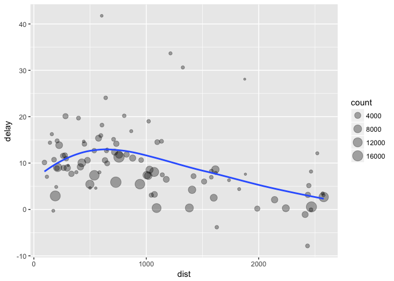
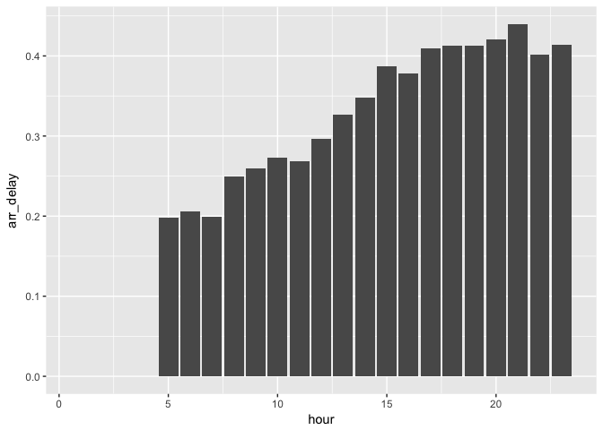
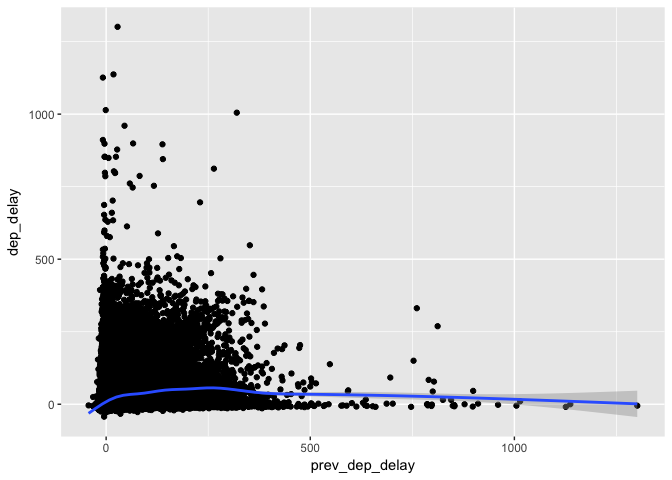

# R-club-May-17
Hajar  
May 13, 2017  
#5.6 Grouped summaries with summarise()


```r
library(nycflights13)
```

```
## Warning: package 'nycflights13' was built under R version 3.3.2
```

```r
library(tidyverse)
```

```
## Warning: package 'tidyverse' was built under R version 3.3.2
```

```
## Loading tidyverse: ggplot2
## Loading tidyverse: tibble
## Loading tidyverse: tidyr
## Loading tidyverse: readr
## Loading tidyverse: purrr
## Loading tidyverse: dplyr
```

```
## Warning: package 'ggplot2' was built under R version 3.3.2
```

```
## Warning: package 'tidyr' was built under R version 3.3.2
```

```
## Warning: package 'readr' was built under R version 3.3.2
```

```
## Conflicts with tidy packages ----------------------------------------------
```

```
## filter(): dplyr, stats
## lag():    dplyr, stats
```

```r
summarise(flights, delay = mean(dep_delay, na.rm = TRUE))
```

```
## # A tibble: 1 × 1
##      delay
##      <dbl>
## 1 12.63907
```

```r
by_day <- group_by(flights, year, month, day)
summarise(by_day, delay = mean(dep_delay, na.rm = TRUE))
```

```
## Source: local data frame [365 x 4]
## Groups: year, month [?]
## 
##     year month   day     delay
##    <int> <int> <int>     <dbl>
## 1   2013     1     1 11.548926
## 2   2013     1     2 13.858824
## 3   2013     1     3 10.987832
## 4   2013     1     4  8.951595
## 5   2013     1     5  5.732218
## 6   2013     1     6  7.148014
## 7   2013     1     7  5.417204
## 8   2013     1     8  2.553073
## 9   2013     1     9  2.276477
## 10  2013     1    10  2.844995
## # ... with 355 more rows
```
#5.6.1 Combining multiple operations with the pipe


```r
by_dest <- group_by(flights, dest)
delay <- summarise(by_dest,
  count = n(),
  dist = mean(distance, na.rm = TRUE),
  delay = mean(arr_delay, na.rm = TRUE)
)
delay <- filter(delay, count > 20, dest != "HNL")
ggplot(data = delay, mapping = aes(x = dist, y = delay)) +
  geom_point(aes(size = count), alpha = 1/3) +
  geom_smooth(se = FALSE)
```

```
## `geom_smooth()` using method = 'loess'
```

<!-- -->


```r
delays <- flights %>% 
  group_by(dest) %>% 
  summarise(
    count = n(),
    dist = mean(distance, na.rm = TRUE),
    delay = mean(arr_delay, na.rm = TRUE)
  ) %>% 
  filter(count > 20, dest != "HNL")
```

#5.6.2 Missing values


```r
flights %>% 
  group_by(year, month, day) %>% 
  summarise(mean = mean(dep_delay))
```

```
## Source: local data frame [365 x 4]
## Groups: year, month [?]
## 
##     year month   day  mean
##    <int> <int> <int> <dbl>
## 1   2013     1     1    NA
## 2   2013     1     2    NA
## 3   2013     1     3    NA
## 4   2013     1     4    NA
## 5   2013     1     5    NA
## 6   2013     1     6    NA
## 7   2013     1     7    NA
## 8   2013     1     8    NA
## 9   2013     1     9    NA
## 10  2013     1    10    NA
## # ... with 355 more rows
```

```r
head(flights)
```

```
## # A tibble: 6 × 19
##    year month   day dep_time sched_dep_time dep_delay arr_time
##   <int> <int> <int>    <int>          <int>     <dbl>    <int>
## 1  2013     1     1      517            515         2      830
## 2  2013     1     1      533            529         4      850
## 3  2013     1     1      542            540         2      923
## 4  2013     1     1      544            545        -1     1004
## 5  2013     1     1      554            600        -6      812
## 6  2013     1     1      554            558        -4      740
## # ... with 12 more variables: sched_arr_time <int>, arr_delay <dbl>,
## #   carrier <chr>, flight <int>, tailnum <chr>, origin <chr>, dest <chr>,
## #   air_time <dbl>, distance <dbl>, hour <dbl>, minute <dbl>,
## #   time_hour <dttm>
```

```r
not_cancelled <- flights %>% 
  filter(!is.na(dep_delay), !is.na(arr_delay))

not_cancelled %>% 
  group_by(year, month, day) %>% 
  summarise(mean = mean(dep_delay))
```

```
## Source: local data frame [365 x 4]
## Groups: year, month [?]
## 
##     year month   day      mean
##    <int> <int> <int>     <dbl>
## 1   2013     1     1 11.435620
## 2   2013     1     2 13.677802
## 3   2013     1     3 10.907778
## 4   2013     1     4  8.965859
## 5   2013     1     5  5.732218
## 6   2013     1     6  7.145959
## 7   2013     1     7  5.417204
## 8   2013     1     8  2.558296
## 9   2013     1     9  2.301232
## 10  2013     1    10  2.844995
## # ... with 355 more rows
```

#5.6.3 Counts


```r
delays <- not_cancelled %>% 
  group_by(tailnum) %>% 
  summarise(
    delay = mean(arr_delay)
  )

ggplot(data = delays, mapping = aes(x = delay)) + 
  geom_freqpoly(binwidth = 10)
```

<!-- -->


```r
delays <- not_cancelled %>% 
  group_by(tailnum) %>% 
  summarise(
    delay = mean(arr_delay, na.rm = TRUE),
    n = n()
  )

ggplot(data = delays, mapping = aes(x = n, y = delay)) + 
  geom_point(alpha = 1/10)
```

<!-- -->


```r
batting <- as_tibble(Lahman::Batting)

batters <- batting %>% 
  group_by(playerID) %>% 
  summarise(
    ba = sum(H, na.rm = TRUE) / sum(AB, na.rm = TRUE),
    ab = sum(AB, na.rm = TRUE)
  )
batters %>% 
  filter(ab > 100) %>% 
  ggplot(mapping = aes(x = ab, y = ba)) +
    geom_point() + 
    geom_smooth(se = FALSE)
```

```
## `geom_smooth()` using method = 'gam'
```

<!-- -->

```r
batters %>% 
  arrange(desc(ba))
```

```
## # A tibble: 18,659 × 3
##     playerID    ba    ab
##        <chr> <dbl> <int>
## 1  abramge01     1     1
## 2  banisje01     1     1
## 3  bartocl01     1     1
## 4   bassdo01     1     1
## 5  birasst01     1     2
## 6  bruneju01     1     1
## 7  burnscb01     1     1
## 8  cammaer01     1     1
## 9   campsh01     1     1
## 10 crockcl01     1     1
## # ... with 18,649 more rows
```

#5.6.4 Useful summary functions


```r
not_cancelled %>% 
  group_by(year, month, day) %>% 
  summarise(
    avg_delay1 = mean(arr_delay),
    avg_delay2 = mean(arr_delay[arr_delay > 0]) # the average positive delay
  )
```

```
## Source: local data frame [365 x 5]
## Groups: year, month [?]
## 
##     year month   day avg_delay1 avg_delay2
##    <int> <int> <int>      <dbl>      <dbl>
## 1   2013     1     1 12.6510229   32.48156
## 2   2013     1     2 12.6928879   32.02991
## 3   2013     1     3  5.7333333   27.66087
## 4   2013     1     4 -1.9328194   28.30976
## 5   2013     1     5 -1.5258020   22.55882
## 6   2013     1     6  4.2364294   24.37270
## 7   2013     1     7 -4.9473118   27.76132
## 8   2013     1     8 -3.2275785   20.78909
## 9   2013     1     9 -0.2642777   25.63415
## 10  2013     1    10 -5.8988159   27.34545
## # ... with 355 more rows
```


```r
not_cancelled %>% 
  group_by(dest) %>% 
  summarise(distance_sd = sd(distance)) %>% 
  arrange(desc(distance_sd))
```

```
## # A tibble: 104 × 2
##     dest distance_sd
##    <chr>       <dbl>
## 1    EGE   10.542765
## 2    SAN   10.350094
## 3    SFO   10.216017
## 4    HNL   10.004197
## 5    SEA    9.977993
## 6    LAS    9.907786
## 7    PDX    9.873299
## 8    PHX    9.862546
## 9    LAX    9.657195
## 10   IND    9.458066
## # ... with 94 more rows
```


```r
not_cancelled %>% 
  group_by(year, month, day) %>% 
  summarise(
    first = min(dep_time),
    last = max(dep_time)
  )
```

```
## Source: local data frame [365 x 5]
## Groups: year, month [?]
## 
##     year month   day first  last
##    <int> <int> <int> <int> <int>
## 1   2013     1     1   517  2356
## 2   2013     1     2    42  2354
## 3   2013     1     3    32  2349
## 4   2013     1     4    25  2358
## 5   2013     1     5    14  2357
## 6   2013     1     6    16  2355
## 7   2013     1     7    49  2359
## 8   2013     1     8   454  2351
## 9   2013     1     9     2  2252
## 10  2013     1    10     3  2320
## # ... with 355 more rows
```


```r
not_cancelled %>% 
  group_by(year, month, day) %>% 
  summarise(hour_perc = mean(arr_delay > 60))
```

```
## Source: local data frame [365 x 4]
## Groups: year, month [?]
## 
##     year month   day  hour_perc
##    <int> <int> <int>      <dbl>
## 1   2013     1     1 0.07220217
## 2   2013     1     2 0.08512931
## 3   2013     1     3 0.05666667
## 4   2013     1     4 0.03964758
## 5   2013     1     5 0.03486750
## 6   2013     1     6 0.04704463
## 7   2013     1     7 0.03333333
## 8   2013     1     8 0.02130045
## 9   2013     1     9 0.02015677
## 10  2013     1    10 0.01829925
## # ... with 355 more rows
```

#5.6.5 Grouping by multiple variables


```r
daily <- group_by(flights, year, month, day)
(per_day   <- summarise(daily, flights = n()))
```

```
## Source: local data frame [365 x 4]
## Groups: year, month [?]
## 
##     year month   day flights
##    <int> <int> <int>   <int>
## 1   2013     1     1     842
## 2   2013     1     2     943
## 3   2013     1     3     914
## 4   2013     1     4     915
## 5   2013     1     5     720
## 6   2013     1     6     832
## 7   2013     1     7     933
## 8   2013     1     8     899
## 9   2013     1     9     902
## 10  2013     1    10     932
## # ... with 355 more rows
```

```r
(per_month <- summarise(per_day, flights = sum(flights)))
```

```
## Source: local data frame [12 x 3]
## Groups: year [?]
## 
##     year month flights
##    <int> <int>   <int>
## 1   2013     1   27004
## 2   2013     2   24951
## 3   2013     3   28834
## 4   2013     4   28330
## 5   2013     5   28796
## 6   2013     6   28243
## 7   2013     7   29425
## 8   2013     8   29327
## 9   2013     9   27574
## 10  2013    10   28889
## 11  2013    11   27268
## 12  2013    12   28135
```

```r
(per_year  <- summarise(per_month, flights = sum(flights)))
```

```
## # A tibble: 1 × 2
##    year flights
##   <int>   <int>
## 1  2013  336776
```

#5.6.6 Ungrouping


```r
daily %>% 
  ungroup() %>%             # no longer grouped by date
  summarise(flights = n()) 
```

```
## # A tibble: 1 × 1
##   flights
##     <int>
## 1  336776
```
#5.6.7 Exercises
1.Brainstorm at least 5 different ways to assess the typical delay characteristics of a group of flights. Consider the following scenarios:

A flight is 15 minutes early 50% of the time, and 15 minutes late 50% of the time.

A flight is always 10 minutes late.

A flight is 30 minutes early 50% of the time, and 30 minutes late 50% of the time.

99% of the time a flight is on time. 1% of the time it’s 2 hours late.

Which is more important: arrival delay or departure delay?
Delay type importance depends on individual preference.I think it depends on you for me I prefer to arrive on time so arrive delay is more important for me.

```r
#A flight is 15 minutes early 50% of the time, and 15 minutes late 50% of the time
flights %>%
  group_by(flight) %>%
  summarize(early_15_min = sum(arr_delay <= -15, na.rm = TRUE) / n(),
            late_15_min = sum(arr_delay >= 15, na.rm = TRUE) / n()) %>%
  filter(early_15_min == 0.5,
         late_15_min == 0.5)
```

```
## # A tibble: 18 × 3
##    flight early_15_min late_15_min
##     <int>        <dbl>       <dbl>
## 1     107          0.5         0.5
## 2    2072          0.5         0.5
## 3    2366          0.5         0.5
## 4    2500          0.5         0.5
## 5    2552          0.5         0.5
## 6    3495          0.5         0.5
## 7    3518          0.5         0.5
## 8    3544          0.5         0.5
## 9    3651          0.5         0.5
## 10   3705          0.5         0.5
## 11   3916          0.5         0.5
## 12   3951          0.5         0.5
## 13   4273          0.5         0.5
## 14   4313          0.5         0.5
## 15   5297          0.5         0.5
## 16   5322          0.5         0.5
## 17   5388          0.5         0.5
## 18   5505          0.5         0.5
```

```r
# A flight is always 10 minutes late.
flights %>%
  group_by(flight) %>%
  summarize(late_10 = sum(arr_delay == 10, na.rm = TRUE) / n()) %>%
  filter(late_10 == 1)
```

```
## # A tibble: 4 × 2
##   flight late_10
##    <int>   <dbl>
## 1   2254       1
## 2   3656       1
## 3   3880       1
## 4   5854       1
```

```r
#A flight is 30 minutes early 50% of the time, and 30 minutes late 50% of the time.
flights %>%
  group_by(flight) %>%
  summarize(early_30_min = sum(arr_delay <= -30, na.rm = TRUE) / n(),
            late_30_min = sum(arr_delay >= 30, na.rm = TRUE) / n()) %>%
  filter(early_30_min == 0.5,
         late_30_min == 0.5)
```

```
## # A tibble: 3 × 3
##   flight early_30_min late_30_min
##    <int>        <dbl>       <dbl>
## 1   3651          0.5         0.5
## 2   3916          0.5         0.5
## 3   3951          0.5         0.5
```

```r
#99% of the time a flight is on time. 1% of the time it’s 2 hours late
flights %>%
  group_by(flight) %>%
  summarize(on_time = sum(arr_delay == 0, na.rm = TRUE) / n(),
            late_2_hours = sum(arr_delay >= 120, na.rm = TRUE) / n()) %>%
  filter(on_time == .99,
         late_2_hours == .01)
```

```
## # A tibble: 0 × 3
## # ... with 3 variables: flight <int>, on_time <dbl>, late_2_hours <dbl>
```

2.Come up with another approach that will give you the same output as not_cancelled %>% count(dest) and not_cancelled %>% count(tailnum, wt = distance) (without using count()).


```r
not_cancelled <- flights %>% 
  filter(!is.na(dep_delay), !is.na(arr_delay))
#first
not_cancelled %>%
  count(dest)
```

```
## # A tibble: 104 × 2
##     dest     n
##    <chr> <int>
## 1    ABQ   254
## 2    ACK   264
## 3    ALB   418
## 4    ANC     8
## 5    ATL 16837
## 6    AUS  2411
## 7    AVL   261
## 8    BDL   412
## 9    BGR   358
## 10   BHM   269
## # ... with 94 more rows
```

```r
#new
not_cancelled %>%
  group_by(dest) %>%
  summarize(n = n())
```

```
## # A tibble: 104 × 2
##     dest     n
##    <chr> <int>
## 1    ABQ   254
## 2    ACK   264
## 3    ALB   418
## 4    ANC     8
## 5    ATL 16837
## 6    AUS  2411
## 7    AVL   261
## 8    BDL   412
## 9    BGR   358
## 10   BHM   269
## # ... with 94 more rows
```

```r
#first
not_cancelled %>%
  count(tailnum, wt = distance)
```

```
## # A tibble: 4,037 × 2
##    tailnum      n
##      <chr>  <dbl>
## 1   D942DN   3418
## 2   N0EGMQ 239143
## 3   N10156 109664
## 4   N102UW  25722
## 5   N103US  24619
## 6   N104UW  24616
## 7   N10575 139903
## 8   N105UW  23618
## 9   N107US  21677
## 10  N108UW  32070
## # ... with 4,027 more rows
```

```r
#new
not_cancelled %>%
  group_by(tailnum) %>%
  summarize(n = sum(distance, na.rm = TRUE))
```

```
## # A tibble: 4,037 × 2
##    tailnum      n
##      <chr>  <dbl>
## 1   D942DN   3418
## 2   N0EGMQ 239143
## 3   N10156 109664
## 4   N102UW  25722
## 5   N103US  24619
## 6   N104UW  24616
## 7   N10575 139903
## 8   N105UW  23618
## 9   N107US  21677
## 10  N108UW  32070
## # ... with 4,027 more rows
```

3.Our definition of cancelled flights (is.na(dep_delay) | is.na(arr_delay) ) is slightly suboptimal. Why? Which is the most important column?

There are no flights which arrived but did not depart, so we can just use !is.na(dep_delay).

4.Look at the number of cancelled flights per day. Is there a pattern? Is the proportion of cancelled flights related to the average delay?


```r
flights %>%
  filter(is.na(dep_delay)) %>%
  count(day)
```

```
## # A tibble: 31 × 2
##      day     n
##    <int> <int>
## 1      1   246
## 2      2   250
## 3      3   109
## 4      4    82
## 5      5   226
## 6      6   296
## 7      7   318
## 8      8   921
## 9      9   593
## 10    10   535
## # ... with 21 more rows
```

```r
flights %>%
  group_by(day) %>%
  summarize(prop_canceled = sum(is.na(dep_delay)) / n(),
            avg_delay = mean(dep_delay, na.rm = TRUE))
```

```
## # A tibble: 31 × 3
##      day prop_canceled avg_delay
##    <int>         <dbl>     <dbl>
## 1      1   0.022290685 14.172660
## 2      2   0.023131014 14.115552
## 3      3   0.009722594 10.811295
## 4      4   0.007414775  5.789651
## 5      5   0.020814146  7.820824
## 6      6   0.026765530  6.990244
## 7      7   0.028948566 14.339177
## 8      8   0.081714134 21.760773
## 9      9   0.054619140 14.644680
## 10    10   0.047652979 18.300505
## # ... with 21 more rows
```

5.Which carrier has the worst delays? Challenge: can you disentangle the effects of bad airports vs. bad carriers? Why/why not? (Hint: think about flights %>% group_by(carrier, dest) %>% summarise(n()))


```r
flights %>%
  group_by(carrier) %>%
  summarize(mean_delay = mean(arr_delay, na.rm = TRUE)) %>%
  arrange(desc(mean_delay))
```

```
## # A tibble: 16 × 2
##    carrier mean_delay
##      <chr>      <dbl>
## 1       F9 21.9207048
## 2       FL 20.1159055
## 3       EV 15.7964311
## 4       YV 15.5569853
## 5       OO 11.9310345
## 6       MQ 10.7747334
## 7       WN  9.6491199
## 8       B6  9.4579733
## 9       9E  7.3796692
## 10      UA  3.5580111
## 11      US  2.1295951
## 12      VX  1.7644644
## 13      DL  1.6443409
## 14      AA  0.3642909
## 15      HA -6.9152047
## 16      AS -9.9308886
```

```r
# challenge: bad airports vs. bad carriers
flights %>%
  group_by(carrier, dest) %>%
  summarize(mean_delay = mean(arr_delay, na.rm = TRUE)) %>%
  group_by(carrier) %>%
  summarize(mean_delay_mad = mad(mean_delay, na.rm = TRUE)) %>%
  arrange(desc(mean_delay_mad))
```

```
## # A tibble: 16 × 2
##    carrier mean_delay_mad
##      <chr>          <dbl>
## 1       VX      12.390156
## 2       OO      10.519400
## 3       YV       8.974067
## 4       9E       8.197407
## 5       EV       7.094112
## 6       DL       7.002298
## 7       UA       5.043940
## 8       US       5.034137
## 9       B6       4.995649
## 10      WN       4.506001
## 11      AA       3.311529
## 12      MQ       2.879322
## 13      FL       1.551060
## 14      AS       0.000000
## 15      F9       0.000000
## 16      HA       0.000000
```

6.What does the sort argument to count() do. When might you use it?

The sort argument will sort the results of count() in descending order of n. This saves you a line of code.

#5.7 Grouped mutates (and filters)


```r
#Find all groups bigger than a threshold:

popular_dests <- flights %>% 
  group_by(dest) %>% 
  filter(n() > 365)
popular_dests
```

```
## Source: local data frame [332,577 x 19]
## Groups: dest [77]
## 
##     year month   day dep_time sched_dep_time dep_delay arr_time
##    <int> <int> <int>    <int>          <int>     <dbl>    <int>
## 1   2013     1     1      517            515         2      830
## 2   2013     1     1      533            529         4      850
## 3   2013     1     1      542            540         2      923
## 4   2013     1     1      544            545        -1     1004
## 5   2013     1     1      554            600        -6      812
## 6   2013     1     1      554            558        -4      740
## 7   2013     1     1      555            600        -5      913
## 8   2013     1     1      557            600        -3      709
## 9   2013     1     1      557            600        -3      838
## 10  2013     1     1      558            600        -2      753
## # ... with 332,567 more rows, and 12 more variables: sched_arr_time <int>,
## #   arr_delay <dbl>, carrier <chr>, flight <int>, tailnum <chr>,
## #   origin <chr>, dest <chr>, air_time <dbl>, distance <dbl>, hour <dbl>,
## #   minute <dbl>, time_hour <dttm>
```
#5.7.1 Exercises

1.Refer back to the lists of useful mutate and filtering functions. Describe how each operation changes when you combine it with grouping.


```r
?mutate
```

```
## Help on topic 'mutate' was found in the following packages:
## 
##   Package               Library
##   plyr                  /Library/Frameworks/R.framework/Versions/3.3/Resources/library
##   dplyr                 /Library/Frameworks/R.framework/Versions/3.3/Resources/library
## 
## 
## Using the first match ...
```

2.Which plane (tailnum) has the worst on-time record?
I define “on-time” in this function as arriving within 30 minutes of the scheduled arrival time.


```r
flights %>%
  group_by(tailnum) %>%
  summarize(prop_on_time = sum(arr_delay <= 30, na.rm = TRUE) / n(),
            mean_arr_delay = mean(arr_delay, na.rm = TRUE),
            flights = n()) %>%
  arrange(prop_on_time, desc(mean_arr_delay))
```

```
## # A tibble: 4,044 × 4
##    tailnum prop_on_time mean_arr_delay flights
##      <chr>        <dbl>          <dbl>   <int>
## 1   N844MH            0            320       1
## 2   N911DA            0            294       1
## 3   N922EV            0            276       1
## 4   N587NW            0            264       1
## 5   N851NW            0            219       1
## 6   N928DN            0            201       1
## 7   N7715E            0            188       1
## 8   N654UA            0            185       1
## 9   N427SW            0            157       1
## 10  N136DL            0            146       1
## # ... with 4,034 more rows
```

3.What time of day should you fly if you want to avoid delays as much as possible?


```r
flights %>%
  group_by(hour) %>%
  summarize(arr_delay = sum(arr_delay > 5, na.rm = TRUE) / n()) %>%
  ggplot(aes(x = hour, y = arr_delay)) +
  geom_col()
```

<!-- -->
Avoid flying in the evening to minimize your arrival delay.

4.For each destination, compute the total minutes of delay. For each, flight, compute the proportion of the total delay for its destinatio

5.Delays are typically temporally correlated: even once the problem that caused the initial delay has been resolved, later flights are delayed to allow earlier flights to leave. Using lag() explore how the delay of a flight is related to the delay of the immediately preceding flight.


```r
flights %>%
  group_by(origin) %>%
  arrange(year, month, day, hour, minute) %>%
  mutate(prev_dep_delay = lag(dep_delay)) %>%
  ggplot(aes(x = prev_dep_delay, y = dep_delay)) +
  geom_point() +
  geom_smooth()
```

```
## `geom_smooth()` using method = 'gam'
```

```
## Warning: Removed 14383 rows containing non-finite values (stat_smooth).
```

```
## Warning: Removed 14383 rows containing missing values (geom_point).
```

<!-- -->
6.Look at each destination. Can you find flights that are suspiciously fast? (i.e. flights that represent a potential data entry error). Compute the air time a flight relative to the shortest flight to that destination. Which flights were most delayed in the air?

7.Find all destinations that are flown by at least two carriers. Use that information to rank the carriers.

8.For each plane, count the number of flights before the first delay of greater than 1 hour
This uses a grouped summary operation. First I group by plane (tailnum), then I create a variable that defines the row number within each plane. I then filter the data to only include flights with delays longer than an hour, and use summarize() in conjunction with first() to find for each plane the row_num of the first flight with an 1+ hour delay. I subtract 1 from that value to count the number of flights before the first delay, rather than including the first flight with the hour or more delay.

```r
flights %>%
  group_by(tailnum) %>%
  mutate(row_num = row_number()) %>%
  filter(arr_delay > 60) %>%
  summarize(first_hour_delay = first(row_num) - 1)
```

```
## # A tibble: 3,371 × 2
##    tailnum first_hour_delay
##      <chr>            <dbl>
## 1   D942DN                0
## 2   N0EGMQ                0
## 3   N10156                9
## 4   N102UW               33
## 5   N104UW                6
## 6   N10575                0
## 7   N105UW               34
## 8   N107US               29
## 9   N108UW                9
## 10  N109UW               15
## # ... with 3,361 more rows
```
#6 Workflow: scripts
#6.2 RStudio diagnostics

