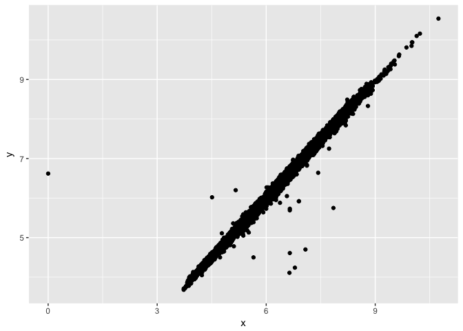
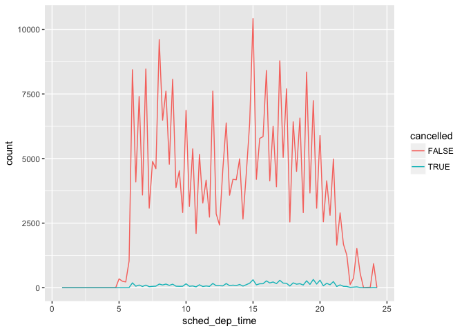
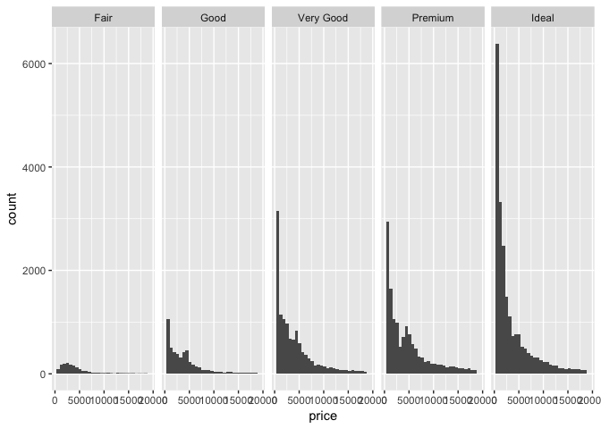
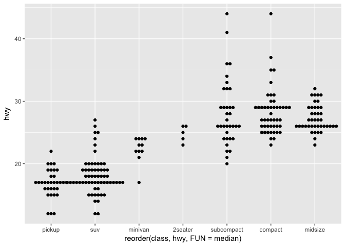
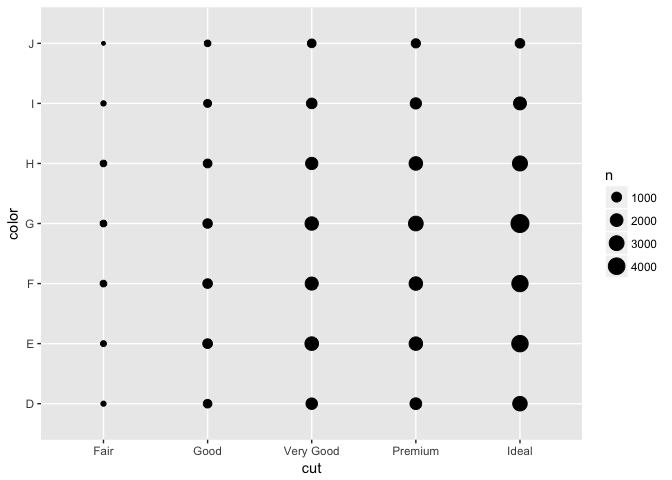
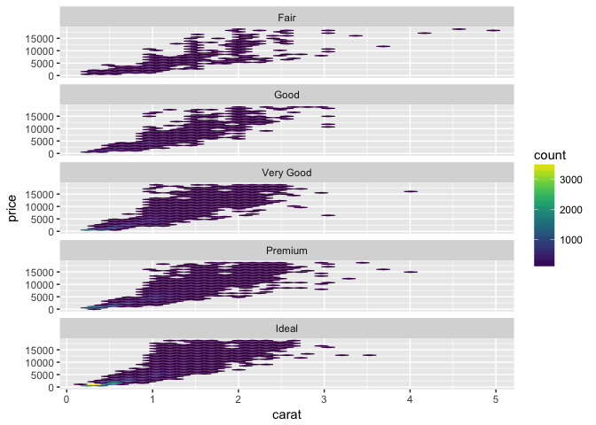

# R-club-May-24
Hajar  
5/19/2017  


```r
#library(tidyverse)
```
#7.2 Questions
#7.3.1 Visualising distributions


```r
library("ggplot2")
```

```
## Warning: package 'ggplot2' was built under R version 3.3.2
```

```r
ggplot(data = diamonds) +
  geom_bar(mapping = aes(x = cut))
```

<!-- -->


```r
library("dplyr")
```

```
## 
## Attaching package: 'dplyr'
```

```
## The following objects are masked from 'package:stats':
## 
##     filter, lag
```

```
## The following objects are masked from 'package:base':
## 
##     intersect, setdiff, setequal, union
```

```r
diamonds %>% 
  count(cut)
```

```
## # A tibble: 5 × 2
##         cut     n
##       <ord> <int>
## 1      Fair  1610
## 2      Good  4906
## 3 Very Good 12082
## 4   Premium 13791
## 5     Ideal 21551
```


```r
ggplot(data = diamonds) +
  geom_histogram(mapping = aes(x = carat), binwidth = 0.5)
```

<!-- -->


```r
diamonds %>% 
  count(cut_width(carat, 0.5))
```

```
## # A tibble: 11 × 2
##    `cut_width(carat, 0.5)`     n
##                     <fctr> <int>
## 1             [-0.25,0.25]   785
## 2              (0.25,0.75] 29498
## 3              (0.75,1.25] 15977
## 4              (1.25,1.75]  5313
## 5              (1.75,2.25]  2002
## 6              (2.25,2.75]   322
## 7              (2.75,3.25]    32
## 8              (3.25,3.75]     5
## 9              (3.75,4.25]     4
## 10             (4.25,4.75]     1
## 11             (4.75,5.25]     1
```

#zome in particular data


```r
smaller <- diamonds %>% 
  filter(carat < 3)
  
ggplot(data = smaller, mapping = aes(x = carat)) +
  geom_histogram(binwidth = 0.1)
```

<!-- -->


```r
ggplot(data = smaller, mapping = aes(x = carat, colour = cut)) +
  geom_freqpoly(binwidth = 0.1)
```

<!-- -->


```r
ggplot(data = smaller, mapping = aes(x = carat)) +
  geom_histogram(binwidth = 0.01)
```

<!-- -->


```r
ggplot(data = faithful, mapping = aes(x = eruptions)) + 
  geom_histogram(binwidth = 0.25)
```

<!-- -->

#7.3.3 Unusual values


```r
ggplot(diamonds) + 
  geom_histogram(mapping = aes(x = y), binwidth = 0.5)
```

<!-- -->


```r
unusual <- diamonds %>% 
  filter(y < 3 | y > 20) %>% 
  select(price, x, y, z) %>%
  arrange(y)
unusual
```

```
## # A tibble: 9 × 4
##   price     x     y     z
##   <int> <dbl> <dbl> <dbl>
## 1  5139  0.00   0.0  0.00
## 2  6381  0.00   0.0  0.00
## 3 12800  0.00   0.0  0.00
## 4 15686  0.00   0.0  0.00
## 5 18034  0.00   0.0  0.00
## 6  2130  0.00   0.0  0.00
## 7  2130  0.00   0.0  0.00
## 8  2075  5.15  31.8  5.12
## 9 12210  8.09  58.9  8.06
```

#7.3.4 Exercises

1.Explore the distribution of each of the x, y, and z variables in diamonds. What do you learn? Think about a diamond and how you might decide which dimension is the length, width, and depth.


```r
ggplot(diamonds, aes(x)) +
  geom_histogram()
```

```
## `stat_bin()` using `bins = 30`. Pick better value with `binwidth`.
```

<!-- -->

```r
ggplot(diamonds, aes(y)) +
  geom_histogram()
```

```
## `stat_bin()` using `bins = 30`. Pick better value with `binwidth`.
```

<!-- -->

```r
ggplot(diamonds, aes(z)) +
  geom_histogram()
```

```
## `stat_bin()` using `bins = 30`. Pick better value with `binwidth`.
```

<!-- -->

2.Explore the distribution of price. Do you discover anything unusual or surprising? (Hint: Carefully think about the binwidth and make sure you try a wide range of values.)


```r
# I used default binwidth
ggplot(diamonds, aes(price)) +
  geom_histogram()
```

```
## `stat_bin()` using `bins = 30`. Pick better value with `binwidth`.
```

<!-- -->

```r
# binwidth = 100
ggplot(diamonds, aes(price)) +
  geom_histogram(binwidth = 100) +
  scale_x_continuous(breaks = seq(0, 20000, by = 1000))
```

<!-- -->

```r
#I want to know much closer price to $1500,by defualt it is not obvious
```

3.How many diamonds are 0.99 carat? How many are 1 carat? What do you think is the cause of the difference?

```r
ggplot(diamonds, aes(carat)) +
  geom_histogram(binwidth = .01) +
  coord_cartesian(xlim = c(.97, 1.03))
```

<!-- -->

4.Compare and contrast coord_cartesian() vs xlim() or ylim() when zooming in on a histogram. What happens if you leave binwidth unset? What happens if you try and zoom so only half a bar shows?


```r
# full plot
ggplot(diamonds, aes(carat, price)) +
  geom_point() +
  geom_smooth()
```

```
## `geom_smooth()` using method = 'gam'
```

<!-- -->

```r
#xlim
ggplot(diamonds, aes(carat, price)) +
  geom_point() +
  geom_smooth() +
  xlim(1, 3)
```

```
## `geom_smooth()` using method = 'gam'
```

```
## Warning: Removed 34912 rows containing non-finite values (stat_smooth).
```

```
## Warning: Removed 34912 rows containing missing values (geom_point).
```

<!-- -->

```r
# coord_cartesian
ggplot(diamonds, aes(carat, price)) +
  geom_point() +
  geom_smooth() +
  coord_cartesian(xlim = c(1, 3))
```

```
## `geom_smooth()` using method = 'gam'
```

<!-- -->

#7.4 Missing values


```r
diamonds2 <- diamonds %>% 
  filter(between(y, 3, 20))
diamonds2
```

```
## # A tibble: 53,931 × 10
##    carat       cut color clarity depth table price     x     y     z
##    <dbl>     <ord> <ord>   <ord> <dbl> <dbl> <int> <dbl> <dbl> <dbl>
## 1   0.23     Ideal     E     SI2  61.5    55   326  3.95  3.98  2.43
## 2   0.21   Premium     E     SI1  59.8    61   326  3.89  3.84  2.31
## 3   0.23      Good     E     VS1  56.9    65   327  4.05  4.07  2.31
## 4   0.29   Premium     I     VS2  62.4    58   334  4.20  4.23  2.63
## 5   0.31      Good     J     SI2  63.3    58   335  4.34  4.35  2.75
## 6   0.24 Very Good     J    VVS2  62.8    57   336  3.94  3.96  2.48
## 7   0.24 Very Good     I    VVS1  62.3    57   336  3.95  3.98  2.47
## 8   0.26 Very Good     H     SI1  61.9    55   337  4.07  4.11  2.53
## 9   0.22      Fair     E     VS2  65.1    61   337  3.87  3.78  2.49
## 10  0.23 Very Good     H     VS1  59.4    61   338  4.00  4.05  2.39
## # ... with 53,921 more rows
```


```r
diamonds2 <- diamonds %>% 
  mutate(y = ifelse(y < 3 | y > 20, NA, y))
diamonds
```

```
## # A tibble: 53,940 × 10
##    carat       cut color clarity depth table price     x     y     z
##    <dbl>     <ord> <ord>   <ord> <dbl> <dbl> <int> <dbl> <dbl> <dbl>
## 1   0.23     Ideal     E     SI2  61.5    55   326  3.95  3.98  2.43
## 2   0.21   Premium     E     SI1  59.8    61   326  3.89  3.84  2.31
## 3   0.23      Good     E     VS1  56.9    65   327  4.05  4.07  2.31
## 4   0.29   Premium     I     VS2  62.4    58   334  4.20  4.23  2.63
## 5   0.31      Good     J     SI2  63.3    58   335  4.34  4.35  2.75
## 6   0.24 Very Good     J    VVS2  62.8    57   336  3.94  3.96  2.48
## 7   0.24 Very Good     I    VVS1  62.3    57   336  3.95  3.98  2.47
## 8   0.26 Very Good     H     SI1  61.9    55   337  4.07  4.11  2.53
## 9   0.22      Fair     E     VS2  65.1    61   337  3.87  3.78  2.49
## 10  0.23 Very Good     H     VS1  59.4    61   338  4.00  4.05  2.39
## # ... with 53,930 more rows
```


```r
ggplot(data = diamonds2, mapping = aes(x = x, y = y)) + 
  geom_point()
```

```
## Warning: Removed 9 rows containing missing values (geom_point).
```

<!-- -->

```r
ggplot(data = diamonds2, mapping = aes(x = x, y = y)) + 
  geom_point(na.rm = TRUE)
```

<!-- -->


```r
nycflights13::flights %>% 
  mutate(
    cancelled = is.na(dep_time),
    sched_hour = sched_dep_time %/% 100,
    sched_min = sched_dep_time %% 100,
    sched_dep_time = sched_hour + sched_min / 60
  ) %>% 
   ggplot(mapping = aes(sched_dep_time)) + 
    geom_freqpoly(mapping = aes(colour = cancelled), binwidth = 1/4)
```

<!-- -->

#7.4.1 Exercises

1.What happens to missing values in a histogram? What happens to missing values in a bar chart? Why is there a difference?


Histograms omit missing values, whereas bar charts draw them as a separate category. 

2.What does na.rm = TRUE do in mean() and sum()?
It strips missing values before computing the statistic.

#7.5 Covariation

7.5.1 A categorical and continuous variable


```r
ggplot(data = diamonds, mapping = aes(x = price)) + 
  geom_freqpoly(mapping = aes(colour = cut), binwidth = 500)
```

<!-- -->

```r
ggplot(diamonds) + 
  geom_bar(mapping = aes(x = cut))
```

<!-- -->

```r
ggplot(data = diamonds, mapping = aes(x = price, y = ..density..)) + 
  geom_freqpoly(mapping = aes(colour = cut), binwidth = 500)
```

<!-- -->


```r
ggplot(data = diamonds, mapping = aes(x = cut, y = price)) +
  geom_boxplot()
```

<!-- -->


```r
ggplot(data = mpg, mapping = aes(x = class, y = hwy)) +
  geom_boxplot()
```

<!-- -->


```r
ggplot(data = mpg) +
  geom_boxplot(mapping = aes(x = reorder(class, hwy, FUN = median), y = hwy))
```

<!-- -->


```r
ggplot(data = mpg) +
  geom_boxplot(mapping = aes(x = reorder(class, hwy, FUN = median), y = hwy)) +
  coord_flip()
```

<!-- -->

#7.5.1.1 Exercises
1.Use what you’ve learned to improve the visualisation of the departure times of cancelled vs. non-cancelled flights.


```r
# original chart
library(nycflights13)
```

```
## Warning: package 'nycflights13' was built under R version 3.3.2
```

```r
flights %>% 
  mutate(
    cancelled = is.na(dep_time),
    sched_hour = sched_dep_time %/% 100,
    sched_min = sched_dep_time %% 100,
    sched_dep_time = sched_hour + sched_min / 60
    ) %>%
  ggplot(mapping = aes(sched_dep_time)) + 
  geom_freqpoly(mapping = aes(colour = cancelled), binwidth = 1/4)
```

<!-- -->

```r
# revised chart
flights %>% 
  mutate(
    cancelled = is.na(dep_time),
    sched_hour = sched_dep_time %/% 100,
    sched_min = sched_dep_time %% 100,
    sched_dep_time = sched_hour + sched_min / 60
    ) %>%
  ggplot(aes(x = sched_dep_time, y = ..density.., color = cancelled)) + 
  geom_freqpoly(binwidth = 1/4)
```

<!-- -->

2.What variable in the diamonds dataset is most important for predicting the price of a diamond? How is that variable correlated with cut? Why does the combination of those two relationships lead to lower quality diamonds being more expensive?


```r
ggplot(diamonds, aes(carat, price)) +
  geom_point() +
  geom_smooth()
```

```
## `geom_smooth()` using method = 'gam'
```

<!-- -->

```r
#Carat size is the most important predictor of price.

ggplot(diamonds, aes(cut, carat)) +
  geom_boxplot()
```

<!-- -->

```r
#This boxplot visualizes the relationship between cut and carat. On average, fair and good cut diamonds are larger than premium and ideal cuts. If carat size is the more dominant predictor of price, then some larger good cut diamonds will be more expensive than smaller ideal cut diamonds.
```

3.Install the ggstance package, and create a horizontal boxplot. How does this compare to using coord_flip()?


```r
#install.packages("ggstance")

#in ggplot2 with coord_flip(), I supply aesthetics as if they were to be drawn vertically
ggplot(diamonds, aes(cut, carat)) +
  geom_boxplot() +
  coord_flip()
```

<!-- -->

4.One problem with boxplots is that they were developed in an era of much smaller datasets and tend to display a prohibitively large number of “outlying values”. One approach to remedy this problem is the letter value plot. Install the lvplot package, and try using geom_lv() to display the distribution of price vs cut. What do you learn? How do you interpret the plots?


```r
devtools::install_github("hadley/lvplot")
```

```
## Skipping install of 'lvplot' from a github remote, the SHA1 (8ce61c77) has not changed since last install.
##   Use `force = TRUE` to force installation
```

```r
library(lvplot)

# with boxplot
ggplot(diamonds, aes(cut, price)) +
  geom_boxplot()
```

<!-- -->

```r
# with lvplot
ggplot(diamonds, aes(cut, price)) +
  geom_lv()
```

<!-- -->

5.Compare and contrast geom_violin() with a facetted geom_histogram(), or a coloured geom_freqpoly(). What are the pros and cons of each method?


```r
# geom_violin
ggplot(diamonds, aes(cut, price)) +
  geom_violin()
```

<!-- -->

```r
# faceted geom_histogram
ggplot(diamonds, aes(price)) +
  geom_histogram() +
  facet_grid(. ~ cut)
```

```
## `stat_bin()` using `bins = 30`. Pick better value with `binwidth`.
```

<!-- -->

```r
# colored geom_freqpoly
ggplot(diamonds, aes(price, color = cut)) +
  geom_freqpoly()
```

```
## `stat_bin()` using `bins = 30`. Pick better value with `binwidth`.
```

<!-- -->

6.If you have a small dataset, it’s sometimes useful to use geom_jitter() to see the relationship between a continuous and categorical variable. The ggbeeswarm package provides a number of methods similar to geom_jitter(). List them and briefly describe what each one does.
geom_quasirandom that produces plots that resemble something between jitter and violin


```r
#install.packages("ggbeeswarm")
library("ggbeeswarm")
```

```
## Warning: package 'ggbeeswarm' was built under R version 3.3.2
```

```r
ggplot(data = mpg) +
  geom_quasirandom(mapping = aes(x = reorder(class, hwy, FUN = median), y = hwy))
```

<!-- -->

```r
ggplot(data = mpg) +
  geom_beeswarm(mapping = aes(x = reorder(class, hwy, FUN = median), y = hwy))
```

<!-- -->

```r
#geom_beeswarm creates a shape similar to a violin plot, but by offsetting the points.
```

#7.5.2 Two categorical variables


```r
ggplot(data = diamonds) +
  geom_count(mapping = aes(x = cut, y = color))
```

<!-- -->

```r
#library("dplyr")
diamonds %>% 
  count(color, cut)
```

```
## Source: local data frame [35 x 3]
## Groups: color [?]
## 
##    color       cut     n
##    <ord>     <ord> <int>
## 1      D      Fair   163
## 2      D      Good   662
## 3      D Very Good  1513
## 4      D   Premium  1603
## 5      D     Ideal  2834
## 6      E      Fair   224
## 7      E      Good   933
## 8      E Very Good  2400
## 9      E   Premium  2337
## 10     E     Ideal  3903
## # ... with 25 more rows
```

```r
diamonds %>% 
  count(color, cut) %>%  
  ggplot(mapping = aes(x = color, y = cut)) +
    geom_tile(mapping = aes(fill = n))
```

<!-- -->

#7.5.2.1 Exercises

1.How could you rescale the count dataset above to more clearly show the distribution of cut within colour, or colour within cut?
prop is the proportion of each cut within a color. 


```r
library("viridis")
diamonds %>% 
  count(color, cut) %>%
  group_by(cut) %>%
  mutate(prop = n / sum(n)) %>%
  ggplot(mapping = aes(x = color, y = cut)) +
  geom_tile(mapping = aes(fill = prop)) + 
  scale_fill_viridis (limits=c(0, 1))
```

<!-- -->

2.Use geom_tile() together with dplyr to explore how average flight delays vary by destination and month of year. What makes the plot difficult to read? How could you improve it?


```r
flights %>%
  group_by(month, dest) %>%
  summarise(dep_delay = mean(dep_delay, na.rm = TRUE)) %>%
  ggplot(aes(x = factor(month), y = dest, fill = dep_delay)) +
  geom_tile() +
 scale_fill_viridis() +
  labs(x = "Month", y = "Destination", fill = "Departure Delay")
```

<!-- -->

3.Why is it slightly better to use aes(x = color, y = cut) rather than aes(x = cut, y = color) in the example above?
It’s usually better to use the categorical variable with a larger number of categories or the longer labels on the y axis.


```r
diamonds %>% 
  count(color, cut) %>%  
  ggplot(mapping = aes(y = color, x = cut)) +
    geom_tile(mapping = aes(fill = n))
```

<!-- -->

#7.5.3 Two continuous variables


```r
ggplot(data = diamonds) +
  geom_point(mapping = aes(x = carat, y = price))
```

<!-- -->

```r
ggplot(data = diamonds) + 
  geom_point(mapping = aes(x = carat, y = price), alpha = 1 / 100)
```

<!-- -->


```r
# install.packages("hexbin")
```

#7.5.3.1 Exercises

1.Instead of summarising the conditional distribution with a boxplot, you could use a frequency polygon. What do you need to consider when using cut_width() vs cut_number()? How does that impact a visualisation of the 2d distribution of carat and price?


```r
ggplot(data = diamonds, 
       mapping = aes(x = price,colour = cut_width(carat, 0.3))) + geom_freqpoly()
```

```
## `stat_bin()` using `bins = 30`. Pick better value with `binwidth`.
```

<!-- -->

```r
ggplot(data = diamonds, 
       mapping = aes(x = price,colour = cut_number(carat, 10))) + geom_freqpoly()
```

```
## `stat_bin()` using `bins = 30`. Pick better value with `binwidth`.
```

<!-- -->

2.Visualise the distribution of carat, partitioned by price.


```r
ggplot(diamonds, aes(x = cut_number(price, 10), y = carat)) +
  geom_boxplot() +
  coord_flip() +
  xlab("Price")
```

<!-- -->

3.How does the price distribution of very large diamonds compare to small diamonds. Is it as you expect, or does it surprise you?
The distribution of very large diamonds is more variable. 

4.Combine two of the techniques you’ve learned to visualise the combined distribution of cut, carat, and price.


```r
ggplot(diamonds, aes(x = carat, y = price)) +
  geom_hex() +
  facet_wrap(~ cut, ncol = 1) +
  scale_fill_viridis()
```

<!-- -->

```r
ggplot(diamonds, aes(color = cut_number(carat, 5), y = price, x = cut)) +
  geom_boxplot()
```

<!-- -->

5.Two dimensional plots reveal outliers that are not visible in one dimensional plots. For example, some points in the plot below have an unusual combination of x and y values, which makes the points outliers even though their x and y values appear normal when examined separately.


```r
ggplot(data = diamonds) +
  geom_point(mapping = aes(x = x, y = y)) +
  coord_cartesian(xlim = c(4, 11), ylim = c(4, 11))
```

<!-- -->
Why is a scatterplot a better display than a binned plot for this case?
