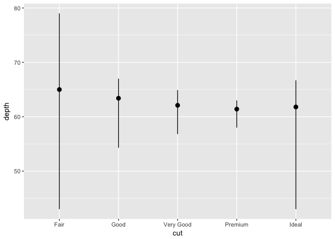
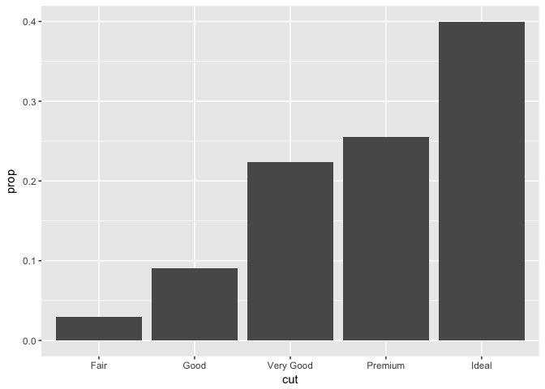
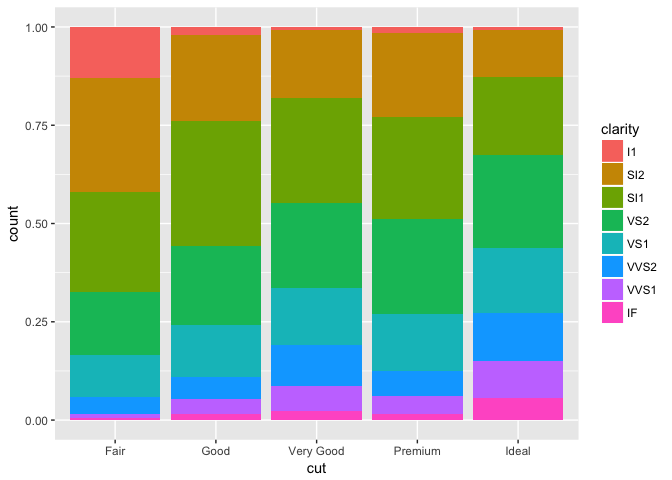
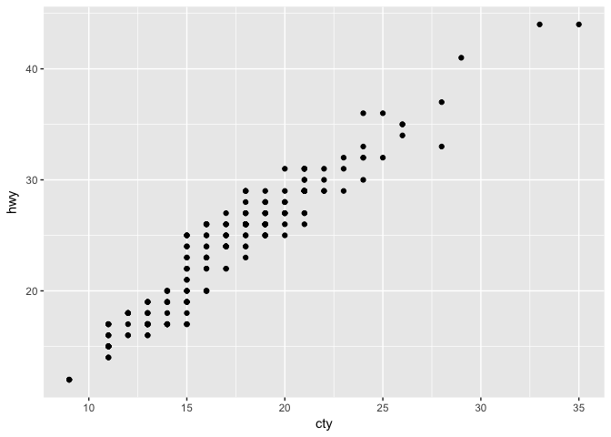

# R-club-May-3
#3.6.1 Exercises
1.What geom would you use to draw a line chart? A boxplot? A histogram? An area chart?
line chart...geom_line()
boxplot...geom_boxplot()
histogram...geom_histogram()
area chart...geom_area()

2.Run this code in your head and predict what the output will look like. Then, run the code in R and check your predictions.

```r
library(ggplot2)
```

```
## Warning: package 'ggplot2' was built under R version 3.3.2
```

```r
ggplot(data = mpg, mapping = aes(x = displ, y = hwy, color = drv)) + 
  geom_point() + 
  geom_smooth(se = FALSE)
```

```
## `geom_smooth()` using method = 'loess'
```

<!-- -->

3.What does show.legend = FALSE do? What happens if you remove it?
Why do you think I used it earlier in the chapter?
?show.legend()
It removes the legend. it removes the key from plotted graph.
I think you use this because you don't need legend before.

4.What does the se argument to geom_smooth() do?
It is relating to draw or not draw a confidence interval around the smoothing line.

5.Will these two graphs look different? Why/why not?


```r
ggplot(data = mpg, mapping = aes(x = displ, y = hwy)) + 
  geom_point() + 
  geom_smooth()
```

```
## `geom_smooth()` using method = 'loess'
```

<!-- -->

```r
ggplot() + 
  geom_point(data = mpg, mapping = aes(x = displ, y = hwy)) + 
  geom_smooth(data = mpg, mapping = aes(x = displ, y = hwy))
```

```
## `geom_smooth()` using method = 'loess'
```

<!-- -->

No,these plots are same. they used the same data and same setting.

6.Recreate the R code necessary to generate the following graphs.
First figure


```r
ggplot(data = mpg, mapping = aes(x = displ, y = hwy)) + 
  geom_point() + 
  geom_smooth(se = FALSE)
```

```
## `geom_smooth()` using method = 'loess'
```

<!-- -->

Second Figure


```r
ggplot(data = mpg, mapping = aes(x = displ, y = hwy)) + 
  geom_smooth(aes(group = drv), se = FALSE) +
  geom_point()
```

```
## `geom_smooth()` using method = 'loess'
```

<!-- -->

Third Figure


```r
ggplot(data = mpg, mapping = aes(x = displ, y = hwy, color = drv)) + 
  geom_point() + 
  geom_smooth(se = FALSE)
```

```
## `geom_smooth()` using method = 'loess'
```

<!-- -->

Fourth Figure


```r
ggplot(data = mpg, mapping = aes(x = displ, y = hwy)) + 
  geom_point(aes(color = drv)) + 
  geom_smooth(se = FALSE)
```

```
## `geom_smooth()` using method = 'loess'
```

<!-- -->

Fifth Figure


```r
ggplot(data = mpg, mapping = aes(x = displ, y = hwy)) + 
  geom_point(aes(color = drv)) +
  geom_smooth(aes(linetype = drv), se = FALSE)
```

```
## `geom_smooth()` using method = 'loess'
```

<!-- -->

sixth Figure


```r
ggplot(data = mpg, mapping = aes(x = displ, y = hwy)) + 
  geom_point(size = 4, colour = "white") + 
  geom_point(aes(colour = drv))
```

<!-- -->

#3.7 Statistical transformations


```r
ggplot(data = diamonds) + 
  geom_bar(mapping = aes(x = cut))
```

<!-- -->

1.What is the default geom associated with stat_summary()? How could you rewrite the previous plot to use that geom function instead of the stat function?
The default geom is geom_pointrange(). for Rewritting, we could write:


```r
ggplot(data = diamonds) +
  geom_pointrange(mapping = aes(x = cut, y = depth),
                  stat = "summary",
                  fun.ymin = min,
                  fun.ymax = max,
                  fun.y = median)
```

<!-- -->

2.What does geom_col() do? How is it different to geom_bar()?
For drawing bar graph geom_bar() uses the stat_count() statistical transformation while geom_col() assumes the values which are transformed to the appropriate values. (for example to show means) 
I think geom_bar(stat = "identity") and geom_col() have same result.
counts are the number of points in bin

3.Most geoms and stats come in pairs that are almost always used in concert. Read through the documentation and make a list of all the pairs. What do they have in common?
geoms stand for "geometric objects." These are the core elements that we see on the plot, object like points, lines, areas, curves.
stats stand for "statistical transformations." These objects summarize the data in different ways such as counting observations, creating a loess line that best fits the data, or adding a confidence interval to the loess line.
geom is core of the plot but stat are not required to produce a plot but both of them enhance the final plot.

4.What variables does stat_smooth() compute? What parameters control its behaviour?
stat_smooth() computes four variables:
?stat_smooth
y - predicted value
ymin - lowest pointwise confidence interval around the mean
ymax - upper pointwise confidence interval around the mean
se - standard error
several parameters control its behaviour but the most importantly are
method controls the smoothing methos to be used
se for drawing confidence interval 
level for determining the level of confidence interval to use.

5.In our proportion bar chart, we need to set group = 1. Why? In other words what is the problem with these two graphs?


```r
ggplot(data = diamonds) + 
  geom_bar(mapping = aes(x = cut, y = ..prop..))
```

<!-- -->


```r
ggplot(data = diamonds) + 
  geom_bar(mapping = aes(x = cut, fill = color, y = ..prop..))
```

<!-- -->

If we don't set group = 1, the proportions for each cut are calculated using the complete dataset, rather than each subset of cut. 
The correct graphs are as follows:


```r
ggplot(data = diamonds) + 
  geom_bar(mapping = aes(x = cut, y = ..prop.., group = 1))
```

<!-- -->


```r
ggplot(data = diamonds) + 
  geom_bar(mapping = aes(x = cut, fill = color, y = ..prop.., group = 1))
```

<!-- -->

#3.8 Position adjustments


```r
ggplot(data = diamonds) + 
  geom_bar(mapping = aes(x = cut, colour = cut))
```

<!-- -->

```r
ggplot(data = diamonds) + 
  geom_bar(mapping = aes(x = cut, fill = cut))
```

<!-- -->


```r
ggplot(data = diamonds) + 
  geom_bar(mapping = aes(x = cut, fill = clarity))
```

<!-- -->


```r
ggplot(data = diamonds, mapping = aes(x = cut, fill = clarity)) + 
  geom_bar(alpha = 1/5, position = "identity")
```

<!-- -->


```r
ggplot(data = diamonds, mapping = aes(x = cut, colour = clarity)) + 
  geom_bar(fill = NA, position = "identity")
```

<!-- -->

```r
ggplot(data = diamonds) + 
  geom_bar(mapping = aes(x = cut, fill = clarity), position = "fill")
```

<!-- -->

```r
ggplot(data = diamonds) + 
  geom_bar(mapping = aes(x = cut, fill = clarity), position = "dodge")
```

<!-- -->

```r
ggplot(data = mpg) + 
  geom_point(mapping = aes(x = displ, y = hwy), position = "jitter")
```

<!-- -->

1.What is the problem with this plot? How could you improve it?


```r
ggplot(data = mpg, mapping = aes(x = cty, y = hwy)) + 
  geom_point()
```

<!-- -->

as we can see many of the data points overlap. by using jitter we can add the points by adding some slight random noise, which will improve the overall visualization.


```r
ggplot(data = mpg, mapping = aes(x = cty, y = hwy)) + 
  geom_jitter()
```

<!-- -->

2.What parameters to geom_jitter() control the amount of jittering
width and height

3.Compare and contrast geom_jitter() with geom_count().


```r
ggplot(data = mpg, mapping = aes(x = cty, y = hwy)) + 
  geom_jitter()
```

<!-- -->

```r
ggplot(data = mpg, mapping = aes(x = cty, y = hwy)) + 
  geom_count()
```

<!-- -->

instead of adding random noise, geom_count() counts the number of observations at each place, then maps the count to point area. It means we have larger points if we have the more located observations at that area, so the number of visible points is equal to geom_point()

4.What’s the default position adjustment for geom_boxplot()? Create a visualisation of the mpg dataset that demonstrates it.


```r
ggplot(data = mpg, mapping = aes(x = class, y = hwy, color = drv)) + 
  geom_boxplot(position = "dodge")
```

<!-- -->

#3.9 Coordinate systems


```r
ggplot(data = mpg, mapping = aes(x = class, y = hwy)) + 
  geom_boxplot()
```

<!-- -->


```r
ggplot(data = mpg, mapping = aes(x = class, y = hwy)) + 
  geom_boxplot() +
  coord_flip()
```

<!-- -->


```r
nz <- map_data("nz")
ggplot(nz, aes(long, lat, group = group)) +
  geom_polygon(fill = "white", colour = "black")
```

<!-- -->

```r
ggplot(nz, aes(long, lat, group = group)) +
  geom_polygon(fill = "white", colour = "black") +
  coord_quickmap()
```

<!-- -->


```r
bar <- ggplot(data = diamonds) + 
  geom_bar(
    mapping = aes(x = cut, fill = cut), 
    show.legend = FALSE,
    width = 1
  ) + 
  theme(aspect.ratio = 1) +
  labs(x = NULL, y = NULL)

bar + coord_flip()
```

<!-- -->

```r
bar + coord_polar()
```

<!-- -->

1.Turn a stacked bar chart into a pie chart using coord_polar().


```r
ggplot(data = mpg, mapping = aes(x = factor(1), fill = class)) +
  geom_bar(width = 1) +
  coord_polar(theta = "y")
```

<!-- -->

2.What does labs() do? Read the documentation.

labs() adds labels to the graph for x and y axes. You can add a title, subtitle, and a label for the xx and yy axes.

3.What’s the difference between coord_quickmap() and coord_map()?

coord_map() projects a portion of the earth (a three-dimensional object) onto a flat (two-dimensional) plane. coord_map() does not preserve straight lines and therefore is computationally intensive,
coord_quickmap() preserves straight lines and is therefore faster to draw with less accurate.

4.What does the plot below tell you about the relationship between city and highway mpg? Why is  coord_fixed() important? What does geom_abline() do?


```r
ggplot(data = mpg, mapping = aes(x = cty, y = hwy)) +
  geom_point() + 
  geom_abline() +
  coord_fixed()
```

<!-- -->

The relationships is kind of linear. But using coord_fixed(), the plot draws equal intervals on the xx and yy axes so they are directly comparable. geom_abline() draws a line that, by default, has an intercept of 0 and slope of 1.

#4 Workflow: basics

1.Why does this code not work?
my_variable <- 10
my_varıable
The second line has a typo

2.Tweak each of the following R commands so that they run correctly:

library(tidyverse)

ggplot(dota = mpg) + 
  geom_point(mapping = aes(x = displ, y = hwy))
  
Error in missing data


```r
ggplot(data = mpg) + 
  geom_point(mapping = aes(x = displ, y = hwy))
```

<!-- -->

fliter(mpg, cyl = 8)

filter(diamond, carat > 3)
Error due to == and typo in diamond


filter(mpg, cyl == 8)
filter(diamonds, carat > 3)


