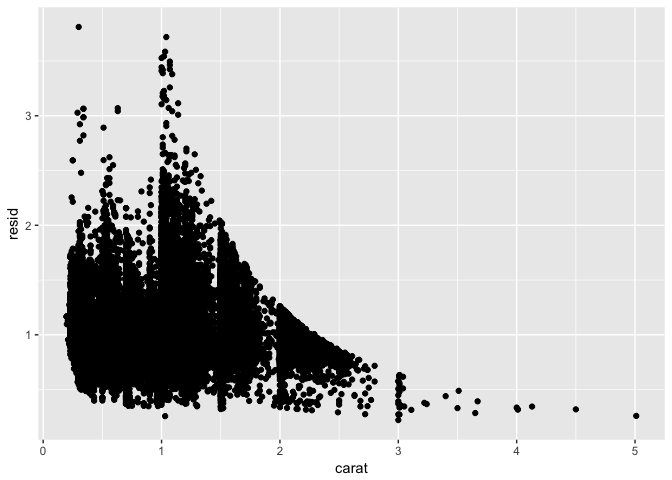

# R-club-May-31
Hajar  
May 29, 2017  

#7.6 Patterns and models


```r
library(ggplot2)
```

```
## Warning: package 'ggplot2' was built under R version 3.3.2
```

```r
ggplot(data = faithful) + 
  geom_point(mapping = aes(x = eruptions, y = waiting))
```

<!-- -->


```r
library(modelr)
library(dplyr)
```

```
## 
## Attaching package: 'dplyr'
```

```
## The following objects are masked from 'package:stats':
## 
##     filter, lag
```

```
## The following objects are masked from 'package:base':
## 
##     intersect, setdiff, setequal, union
```

```r
mod <- lm(log(price) ~ log(carat), data = diamonds)


diamonds2 <- diamonds %>% 
  add_residuals(mod) %>% 
  mutate(resid = exp(resid))

ggplot(data = diamonds2) + 
  geom_point(mapping = aes(x = carat, y = resid))
```

<!-- -->


```r
ggplot(data = diamonds2) + 
  geom_boxplot(mapping = aes(x = cut, y = resid))
```

<!-- -->

#7.7 ggplot2 calls


```r
ggplot(data = faithful, mapping = aes(x = eruptions)) + 
  geom_freqpoly(binwidth = 0.25)
```

<!-- -->

```r
ggplot(faithful, aes(eruptions)) + 
  geom_freqpoly(binwidth = 0.25)
```

<!-- -->

```r
diamonds %>% 
  count(cut, clarity) %>% 
  ggplot(aes(clarity, cut, fill = n)) + 
    geom_tile()
```

<!-- -->
#7.8 Learning more

#10 Tibbles

#10.1.1 Prerequisites


```r
library(tidyverse)
```

```
## Warning: package 'tidyverse' was built under R version 3.3.2
```

```
## Loading tidyverse: tibble
## Loading tidyverse: tidyr
## Loading tidyverse: readr
## Loading tidyverse: purrr
```

```
## Warning: package 'tidyr' was built under R version 3.3.2
```

```
## Warning: package 'readr' was built under R version 3.3.2
```

```
## Conflicts with tidy packages ----------------------------------------------
```

```
## filter(): dplyr, stats
## lag():    dplyr, stats
```

#10.2 Creating tibbles


```r
as_tibble(iris)
```

```
## # A tibble: 150 × 5
##    Sepal.Length Sepal.Width Petal.Length Petal.Width Species
##           <dbl>       <dbl>        <dbl>       <dbl>  <fctr>
## 1           5.1         3.5          1.4         0.2  setosa
## 2           4.9         3.0          1.4         0.2  setosa
## 3           4.7         3.2          1.3         0.2  setosa
## 4           4.6         3.1          1.5         0.2  setosa
## 5           5.0         3.6          1.4         0.2  setosa
## 6           5.4         3.9          1.7         0.4  setosa
## 7           4.6         3.4          1.4         0.3  setosa
## 8           5.0         3.4          1.5         0.2  setosa
## 9           4.4         2.9          1.4         0.2  setosa
## 10          4.9         3.1          1.5         0.1  setosa
## # ... with 140 more rows
```

```r
tibble(
  x = 1:5, 
  y = 1, 
  z = x ^ 2 + y
)
```

```
## # A tibble: 5 × 3
##       x     y     z
##   <int> <dbl> <dbl>
## 1     1     1     2
## 2     2     1     5
## 3     3     1    10
## 4     4     1    17
## 5     5     1    26
```

```r
tb <- tibble(
  `:)` = "smile", 
  ` ` = "space",
  `2000` = "number"
)
tb
```

```
## # A tibble: 1 × 3
##    `:)`   ` ` `2000`
##   <chr> <chr>  <chr>
## 1 smile space number
```

#10.3 Tibbles vs. data.frame
#10.3.1 Printing


```r
tibble(
  a = lubridate::now() + runif(1e3) * 86400,
  b = lubridate::today() + runif(1e3) * 30,
  c = 1:1e3,
  d = runif(1e3),
  e = sample(letters, 1e3, replace = TRUE)
)
```

```
## # A tibble: 1,000 × 5
##                      a          b     c         d     e
##                 <dttm>     <date> <int>     <dbl> <chr>
## 1  2017-05-29 20:47:05 2017-06-12     1 0.9038086     n
## 2  2017-05-30 01:53:09 2017-06-19     2 0.4224085     n
## 3  2017-05-30 04:02:54 2017-06-05     3 0.1223788     i
## 4  2017-05-30 07:30:20 2017-06-07     4 0.6811990     l
## 5  2017-05-29 22:33:24 2017-06-27     5 0.2286786     m
## 6  2017-05-30 05:14:52 2017-06-24     6 0.4161954     m
## 7  2017-05-30 07:47:16 2017-06-26     7 0.6834873     k
## 8  2017-05-30 08:35:32 2017-06-21     8 0.5293672     u
## 9  2017-05-30 01:59:01 2017-05-29     9 0.7057631     u
## 10 2017-05-29 16:41:09 2017-05-30    10 0.3384146     p
## # ... with 990 more rows
```

```r
nycflights13::flights %>% 
  print(n = 10, width = Inf)
```

```
## # A tibble: 336,776 × 19
##     year month   day dep_time sched_dep_time dep_delay arr_time
##    <int> <int> <int>    <int>          <int>     <dbl>    <int>
## 1   2013     1     1      517            515         2      830
## 2   2013     1     1      533            529         4      850
## 3   2013     1     1      542            540         2      923
## 4   2013     1     1      544            545        -1     1004
## 5   2013     1     1      554            600        -6      812
## 6   2013     1     1      554            558        -4      740
## 7   2013     1     1      555            600        -5      913
## 8   2013     1     1      557            600        -3      709
## 9   2013     1     1      557            600        -3      838
## 10  2013     1     1      558            600        -2      753
##    sched_arr_time arr_delay carrier flight tailnum origin  dest air_time
##             <int>     <dbl>   <chr>  <int>   <chr>  <chr> <chr>    <dbl>
## 1             819        11      UA   1545  N14228    EWR   IAH      227
## 2             830        20      UA   1714  N24211    LGA   IAH      227
## 3             850        33      AA   1141  N619AA    JFK   MIA      160
## 4            1022       -18      B6    725  N804JB    JFK   BQN      183
## 5             837       -25      DL    461  N668DN    LGA   ATL      116
## 6             728        12      UA   1696  N39463    EWR   ORD      150
## 7             854        19      B6    507  N516JB    EWR   FLL      158
## 8             723       -14      EV   5708  N829AS    LGA   IAD       53
## 9             846        -8      B6     79  N593JB    JFK   MCO      140
## 10            745         8      AA    301  N3ALAA    LGA   ORD      138
##    distance  hour minute           time_hour
##       <dbl> <dbl>  <dbl>              <dttm>
## 1      1400     5     15 2013-01-01 05:00:00
## 2      1416     5     29 2013-01-01 05:00:00
## 3      1089     5     40 2013-01-01 05:00:00
## 4      1576     5     45 2013-01-01 05:00:00
## 5       762     6      0 2013-01-01 06:00:00
## 6       719     5     58 2013-01-01 05:00:00
## 7      1065     6      0 2013-01-01 06:00:00
## 8       229     6      0 2013-01-01 06:00:00
## 9       944     6      0 2013-01-01 06:00:00
## 10      733     6      0 2013-01-01 06:00:00
## # ... with 3.368e+05 more rows
```

```r
nycflights13::flights %>% 
  View()
```

#10.3.2 Subsetting


```r
df <- tibble(
  x = runif(5),
  y = rnorm(5)
)
df$x
```

```
## [1] 0.89408588 0.06973547 0.52052412 0.76618910 0.61021042
```

```r
df[["x"]]
```

```
## [1] 0.89408588 0.06973547 0.52052412 0.76618910 0.61021042
```

```r
df[[1]]
```

```
## [1] 0.89408588 0.06973547 0.52052412 0.76618910 0.61021042
```

```r
df %>% .$x
```

```
## [1] 0.89408588 0.06973547 0.52052412 0.76618910 0.61021042
```

```r
df %>% .[["x"]]
```

```
## [1] 0.89408588 0.06973547 0.52052412 0.76618910 0.61021042
```

#0.4 Interacting with older code


```r
class(tb)
```

```
## [1] "tbl_df"     "tbl"        "data.frame"
```

```r
str(tb)
```

```
## Classes 'tbl_df', 'tbl' and 'data.frame':	1 obs. of  3 variables:
##  $ :)  : chr "smile"
##  $     : chr "space"
##  $ 2000: chr "number"
```

```r
class(as.data.frame(tb))
```

```
## [1] "data.frame"
```

#10.5 Exercises

1.How can you tell if an object is a tibble? (Hint: try printing mtcars, which is a regular data frame).


```r
print(mtcars)
```

```
##                      mpg cyl  disp  hp drat    wt  qsec vs am gear carb
## Mazda RX4           21.0   6 160.0 110 3.90 2.620 16.46  0  1    4    4
## Mazda RX4 Wag       21.0   6 160.0 110 3.90 2.875 17.02  0  1    4    4
## Datsun 710          22.8   4 108.0  93 3.85 2.320 18.61  1  1    4    1
## Hornet 4 Drive      21.4   6 258.0 110 3.08 3.215 19.44  1  0    3    1
## Hornet Sportabout   18.7   8 360.0 175 3.15 3.440 17.02  0  0    3    2
## Valiant             18.1   6 225.0 105 2.76 3.460 20.22  1  0    3    1
## Duster 360          14.3   8 360.0 245 3.21 3.570 15.84  0  0    3    4
## Merc 240D           24.4   4 146.7  62 3.69 3.190 20.00  1  0    4    2
## Merc 230            22.8   4 140.8  95 3.92 3.150 22.90  1  0    4    2
## Merc 280            19.2   6 167.6 123 3.92 3.440 18.30  1  0    4    4
## Merc 280C           17.8   6 167.6 123 3.92 3.440 18.90  1  0    4    4
## Merc 450SE          16.4   8 275.8 180 3.07 4.070 17.40  0  0    3    3
## Merc 450SL          17.3   8 275.8 180 3.07 3.730 17.60  0  0    3    3
## Merc 450SLC         15.2   8 275.8 180 3.07 3.780 18.00  0  0    3    3
## Cadillac Fleetwood  10.4   8 472.0 205 2.93 5.250 17.98  0  0    3    4
## Lincoln Continental 10.4   8 460.0 215 3.00 5.424 17.82  0  0    3    4
## Chrysler Imperial   14.7   8 440.0 230 3.23 5.345 17.42  0  0    3    4
## Fiat 128            32.4   4  78.7  66 4.08 2.200 19.47  1  1    4    1
## Honda Civic         30.4   4  75.7  52 4.93 1.615 18.52  1  1    4    2
## Toyota Corolla      33.9   4  71.1  65 4.22 1.835 19.90  1  1    4    1
## Toyota Corona       21.5   4 120.1  97 3.70 2.465 20.01  1  0    3    1
## Dodge Challenger    15.5   8 318.0 150 2.76 3.520 16.87  0  0    3    2
## AMC Javelin         15.2   8 304.0 150 3.15 3.435 17.30  0  0    3    2
## Camaro Z28          13.3   8 350.0 245 3.73 3.840 15.41  0  0    3    4
## Pontiac Firebird    19.2   8 400.0 175 3.08 3.845 17.05  0  0    3    2
## Fiat X1-9           27.3   4  79.0  66 4.08 1.935 18.90  1  1    4    1
## Porsche 914-2       26.0   4 120.3  91 4.43 2.140 16.70  0  1    5    2
## Lotus Europa        30.4   4  95.1 113 3.77 1.513 16.90  1  1    5    2
## Ford Pantera L      15.8   8 351.0 264 4.22 3.170 14.50  0  1    5    4
## Ferrari Dino        19.7   6 145.0 175 3.62 2.770 15.50  0  1    5    6
## Maserati Bora       15.0   8 301.0 335 3.54 3.570 14.60  0  1    5    8
## Volvo 142E          21.4   4 121.0 109 4.11 2.780 18.60  1  1    4    2
```

```r
str(mtcars)
```

```
## 'data.frame':	32 obs. of  11 variables:
##  $ mpg : num  21 21 22.8 21.4 18.7 18.1 14.3 24.4 22.8 19.2 ...
##  $ cyl : num  6 6 4 6 8 6 8 4 4 6 ...
##  $ disp: num  160 160 108 258 360 ...
##  $ hp  : num  110 110 93 110 175 105 245 62 95 123 ...
##  $ drat: num  3.9 3.9 3.85 3.08 3.15 2.76 3.21 3.69 3.92 3.92 ...
##  $ wt  : num  2.62 2.88 2.32 3.21 3.44 ...
##  $ qsec: num  16.5 17 18.6 19.4 17 ...
##  $ vs  : num  0 0 1 1 0 1 0 1 1 1 ...
##  $ am  : num  1 1 1 0 0 0 0 0 0 0 ...
##  $ gear: num  4 4 4 3 3 3 3 4 4 4 ...
##  $ carb: num  4 4 1 1 2 1 4 2 2 4 ...
```

```r
class(mtcars)
```

```
## [1] "data.frame"
```

2.Compare and contrast the following operations on a data.frame and equivalent tibble. What is different? Why might the default data frame behaviours cause you frustration?


```r
#on a dataframe
df <- data.frame(abc = 1, xyz = "a")
df$x
```

```
## [1] a
## Levels: a
```

```r
df[, "xyz"]
```

```
## [1] a
## Levels: a
```

```r
df[, c("abc", "xyz")]
```

```
##   abc xyz
## 1   1   a
```


```r
# on a tibble
df <- tibble(abc = 1, xyz = "a")
df$x
```

```
## Warning: Unknown column 'x'
```

```
## NULL
```

```r
#> Warning: Unknown column 'x'
#> NULL
df[, "xyz"]
```

```
## # A tibble: 1 × 1
##     xyz
##   <chr>
## 1     a
```

```r
df[, c("abc", "xyz")]
```

```
## # A tibble: 1 × 2
##     abc   xyz
##   <dbl> <chr>
## 1     1     a
```

```r
#Tibbles never do partial matching; data frames do.
```

3.If you have the name of a variable stored in an object, e.g. var <- "mpg", how can you extract the reference variable from a tibble?


```r
var <- "hwy"
mpg[[var]]
```

```
##   [1] 29 29 31 30 26 26 27 26 25 28 27 25 25 25 25 24 25 23 20 15 20 17 17
##  [24] 26 23 26 25 24 19 14 15 17 27 30 26 29 26 24 24 22 22 24 24 17 22 21
##  [47] 23 23 19 18 17 17 19 19 12 17 15 17 17 12 17 16 18 15 16 12 17 17 16
##  [70] 12 15 16 17 15 17 17 18 17 19 17 19 19 17 17 17 16 16 17 15 17 26 25
##  [93] 26 24 21 22 23 22 20 33 32 32 29 32 34 36 36 29 26 27 30 31 26 26 28
## [116] 26 29 28 27 24 24 24 22 19 20 17 12 19 18 14 15 18 18 15 17 16 18 17
## [139] 19 19 17 29 27 31 32 27 26 26 25 25 17 17 20 18 26 26 27 28 25 25 24
## [162] 27 25 26 23 26 26 26 26 25 27 25 27 20 20 19 17 20 17 29 27 31 31 26
## [185] 26 28 27 29 31 31 26 26 27 30 33 35 37 35 15 18 20 20 22 17 19 18 20
## [208] 29 26 29 29 24 44 29 26 29 29 29 29 23 24 44 41 29 26 28 29 29 29 28
## [231] 29 26 26 26
```

```r
# i am not sure
```

4.Practice referring to non-syntactic names in the following data frame by:


```r
annoying <- tibble(
  `1` = 1:10,
  `2` = `1` * 2 + rnorm(length(`1`))
)

#1.Extracting the variable called 1.
annoying$`1`
```

```
##  [1]  1  2  3  4  5  6  7  8  9 10
```

```r
#2.Plotting a scatterplot of 1 vs 2.

ggplot(annoying, aes(`1`, `2`)) +
  geom_point()
```

<!-- -->

```r
#3.Creating a new column called 3 which is 2 divided by 1.

annoying <- mutate(annoying, `3` = `2` / `1`)
annoying
```

```
## # A tibble: 10 × 3
##      `1`       `2`      `3`
##    <int>     <dbl>    <dbl>
## 1      1  1.396256 1.396256
## 2      2  3.796615 1.898307
## 3      3  6.838578 2.279526
## 4      4  6.960002 1.740000
## 5      5  9.225765 1.845153
## 6      6 12.143708 2.023951
## 7      7 15.585918 2.226560
## 8      8 15.267254 1.908407
## 9      9 17.384209 1.931579
## 10    10 20.246160 2.024616
```

```r
#4.Renaming the columns to one, two and three.

rename(annoying,
       one = `1`,
       two = `2`,
       three = `3`)
```

```
## # A tibble: 10 × 3
##      one       two    three
##    <int>     <dbl>    <dbl>
## 1      1  1.396256 1.396256
## 2      2  3.796615 1.898307
## 3      3  6.838578 2.279526
## 4      4  6.960002 1.740000
## 5      5  9.225765 1.845153
## 6      6 12.143708 2.023951
## 7      7 15.585918 2.226560
## 8      8 15.267254 1.908407
## 9      9 17.384209 1.931579
## 10    10 20.246160 2.024616
```

#5.What does tibble::enframe() do? When might you use it?


```r
?enframe
enframe(c(a = 5, b = 7))
```

```
## # A tibble: 2 × 2
##    name value
##   <chr> <dbl>
## 1     a     5
## 2     b     7
```

```r
enframe(1:6)
```

```
## # A tibble: 6 × 2
##    name value
##   <int> <int>
## 1     1     1
## 2     2     2
## 3     3     3
## 4     4     4
## 5     5     5
## 6     6     6
```

```r
#enframe() is a function that converts named atomic vectors or lists to two-column data frames. we use it if we have data stored in a named vector and we want to add it to a data frame and preserve both the name attribute and the actual value.
```

#6.What option controls how many additional column names are printed at the footer of a tibble?


```r
?print.tbl_df

nycflights13::flights %>% 
  print(n = 4, width = Inf) 
```

```
## # A tibble: 336,776 × 19
##    year month   day dep_time sched_dep_time dep_delay arr_time
##   <int> <int> <int>    <int>          <int>     <dbl>    <int>
## 1  2013     1     1      517            515         2      830
## 2  2013     1     1      533            529         4      850
## 3  2013     1     1      542            540         2      923
## 4  2013     1     1      544            545        -1     1004
##   sched_arr_time arr_delay carrier flight tailnum origin  dest air_time
##            <int>     <dbl>   <chr>  <int>   <chr>  <chr> <chr>    <dbl>
## 1            819        11      UA   1545  N14228    EWR   IAH      227
## 2            830        20      UA   1714  N24211    LGA   IAH      227
## 3            850        33      AA   1141  N619AA    JFK   MIA      160
## 4           1022       -18      B6    725  N804JB    JFK   BQN      183
##   distance  hour minute           time_hour
##      <dbl> <dbl>  <dbl>              <dttm>
## 1     1400     5     15 2013-01-01 05:00:00
## 2     1416     5     29 2013-01-01 05:00:00
## 3     1089     5     40 2013-01-01 05:00:00
## 4     1576     5     45 2013-01-01 05:00:00
## # ... with 3.368e+05 more rows
```

```r
# n for rows, width = Inf means print all columns  

nycflights13::flights %>% 
  print(n = 4, width = NULL, n_extra = 3)  
```

```
## # A tibble: 336,776 × 19
##    year month   day dep_time sched_dep_time dep_delay arr_time
##   <int> <int> <int>    <int>          <int>     <dbl>    <int>
## 1  2013     1     1      517            515         2      830
## 2  2013     1     1      533            529         4      850
## 3  2013     1     1      542            540         2      923
## 4  2013     1     1      544            545        -1     1004
## # ... with 3.368e+05 more rows, and 12 more variables:
## #   sched_arr_time <int>, arr_delay <dbl>, carrier <chr>, ...
```

```r
nycflights13::flights %>% 
  print(n = 3, width = NULL, n_extra = 7)  
```

```
## # A tibble: 336,776 × 19
##    year month   day dep_time sched_dep_time dep_delay arr_time
##   <int> <int> <int>    <int>          <int>     <dbl>    <int>
## 1  2013     1     1      517            515         2      830
## 2  2013     1     1      533            529         4      850
## 3  2013     1     1      542            540         2      923
## # ... with 3.368e+05 more rows, and 12 more variables:
## #   sched_arr_time <int>, arr_delay <dbl>, carrier <chr>, flight <int>,
## #   tailnum <chr>, origin <chr>, dest <chr>, ...
```

